# Interactive Visualization w/ `bokeh` in 🐍

## Important Links

[Bokeh Official Homepage](https://bokeh.pydata.org/en/latest/)

## Installation

```
pip install bokeh
```

[Official Installation Instructions](https://bokeh.pydata.org/en/latest/docs/installation.html)

## Basic Usage

Most all scripts that feature a Bokeh chart will have the following imports:

```
from bokeh.io import output_file, show
from bokeh.plotting import figure
```

The `output_file` method converts the visualization to HMTL and JavaScript
The `show` method opens the visualization in a web browser
The `figure` method creates a `Figure()` object in which the visualization is built 

Sometimes when  rendering multiple visualizations sequentially (like in the example snippets below) you may see that past renders are not being cleared with each execution. If this is a problem, import and run the following between executions:

```
from bokeh.plotting import reset_output
reset_output()
```

A simple chart can be made by creating a `Figure` and then drawing representations on it with ***glyphs***. Glyphs are visual shapes - ie. circles, squares, asterisks, lines, etc. [The Bokeh `Figure` object contains numerous glyph options](https://bokeh.pydata.org/en/latest/docs/reference/plotting.html):

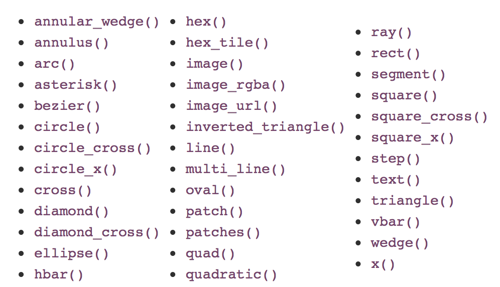 

A very simple chart creation may look like something below. The `circle()` method is given two lists - one containing x-coordinates, one containing y-coordinates. The circles are rendered on the `Figure()` object `plot`, written to *circles.html* and then opened in a web browser via `show(plot)`. 

```
# Very simple chart example
# Using circle glyphs to plot a set of (x,y) coordinates
plot = figure(plot_width=400, plot_height=400)
plot.circle(x=[1,2,3,4], y=[1,2,3,4])
output_file('circles.html')
show(plot)
```

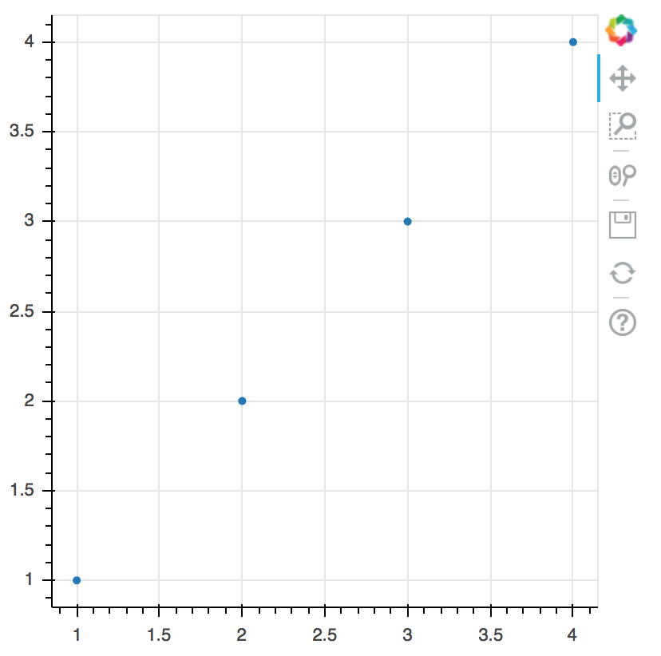 

Similar to `circle()`, other glyphs can be added as markers. The cope snippet above draws additional glyphs at coordinates represented by `square()` and `x()` glyphs. 

```
plot.square(x=[2,4,6,8], y=[2,4,6,8])
plot.x(x=[3,6,9,12], y=[3,6,9,12])
output_file('circle_square_x.html')
show(plot)
```

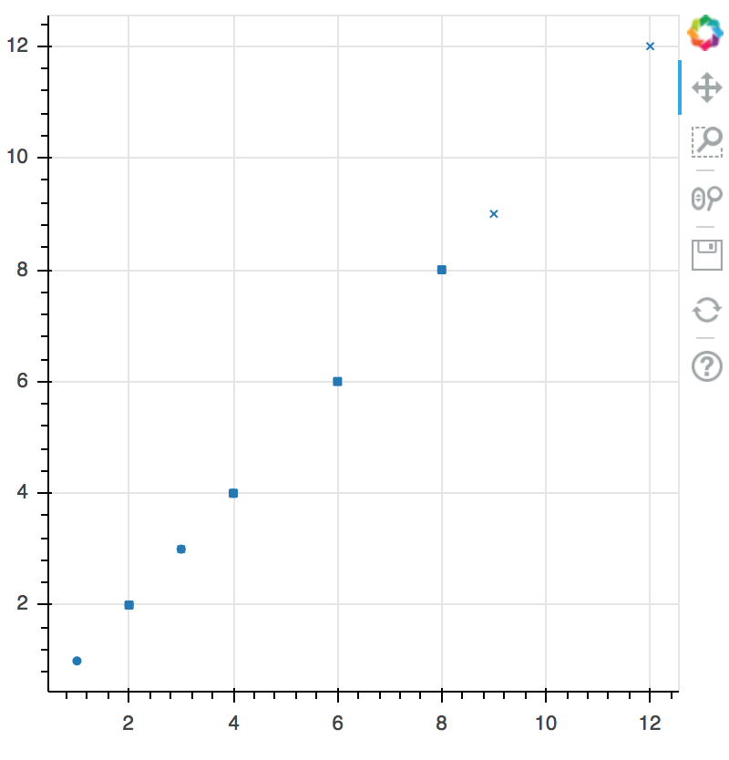 

The various glyph methods have attribute parameters, common examples being:

* **size**: a number between 0 and 100, 100 being the size of the figure
* **color**: color values in hex strinks, RGB tuples between 0 and 255, of any of the [147 CSS color names](http://www.colors.commutercreative.com/grid/)
* **alpha**: a number between 0 (invisible) and 1 (opaque), representative of the transparency

```
sca = figure(plot_width=400, plot_height=400)
sca.circle(x=1, y=1, color='blue', size=10, alpha=0.5)
sca.circle_x(x=2, y=2, color='green', size=15, alpha=0.75)
sca.circle_cross(x=3, y=3, color='grey', size=20, alpha=1)
output_file('size_color_alpha.html')
show(sca)
```

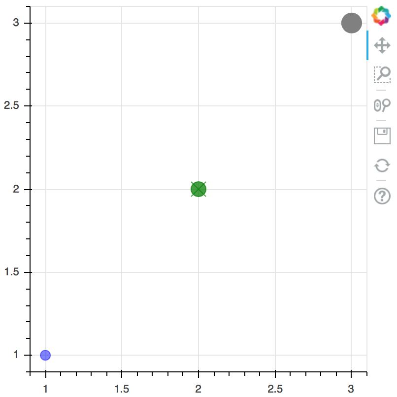 

To connect markers with lines, use the line glyph.

```
linefig = figure(plot_width=400, plot_height=400)
linefig.line(x=[2,4,6,8], y=[2,4,6,8])
output_file('lines.html')
show(linefig)
```

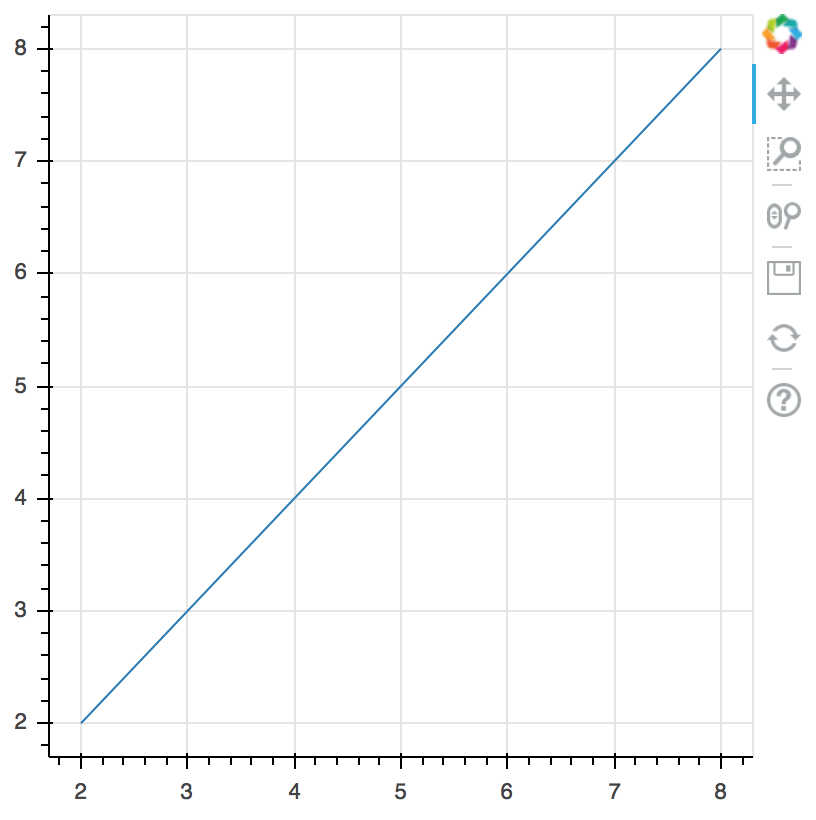 

Custom geometric shapes can be drawn using the `patches()` glyph function. This method takes as input a list of lists containing numeric values specifying the vertices in the x- and y-dimensions. 

```
patchfig = figure()
x_vertices = [[1,1,2,2], [2,2,4], [2,2,3,3]]
y_vertices = [[2,5,5,2], [3,5,5], [2,3,4,2]] 
patchfig.patches(x_vertices, y_vertices, line_color='white', fill_color=['blue','navy','lightblue'])
output_file('patches.html')
show(patchfig)
```

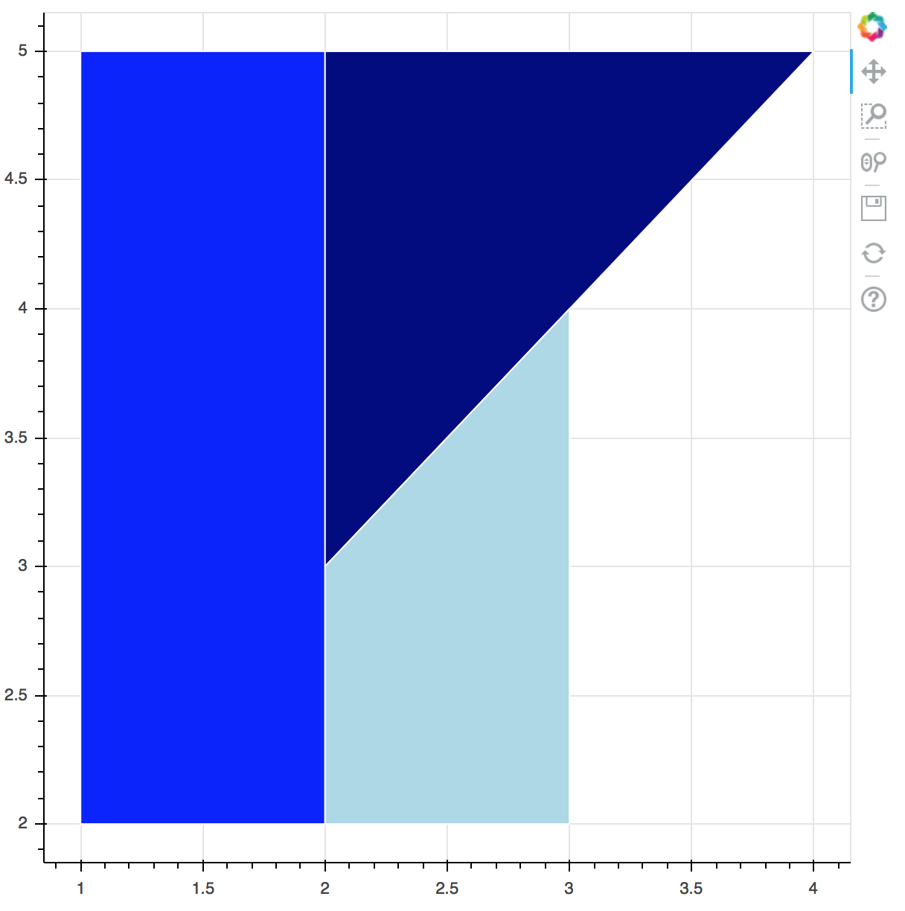 All of the examples above used python `lists` for simplification. Additionally, `numpy` arrays and `pandas` DataFrame columns can also be used as input.

```
import numpy as np
x = np.linspace(0,np.pi,1000)
y = np.sin(x)
plot = figure()
plot.line(x, y, line_dash='dotted')
output_file('numpy_sin.html')
show(plot)
```

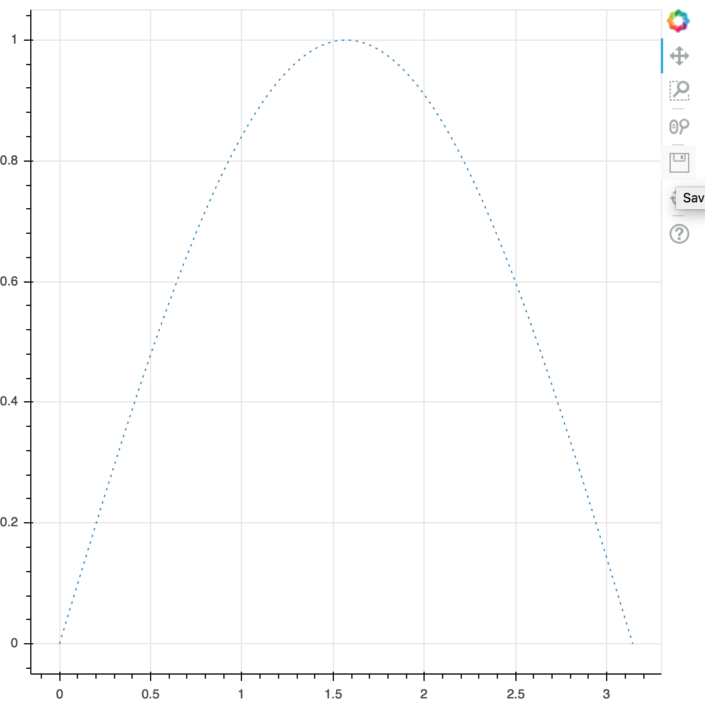 

```
import pandas as pd
df = pd.DataFrame([[1,1,'red', 10], [2,2,'pink',12], [3,3,'purple',14], [4,4,'orange',16]], columns=['x','y','color','size'])
plot = figure()
plot.x(df['x'], df['y'], color=df['color'], size=df['size'])
output_file('pandas_dataframe.html')
show(plot)
```

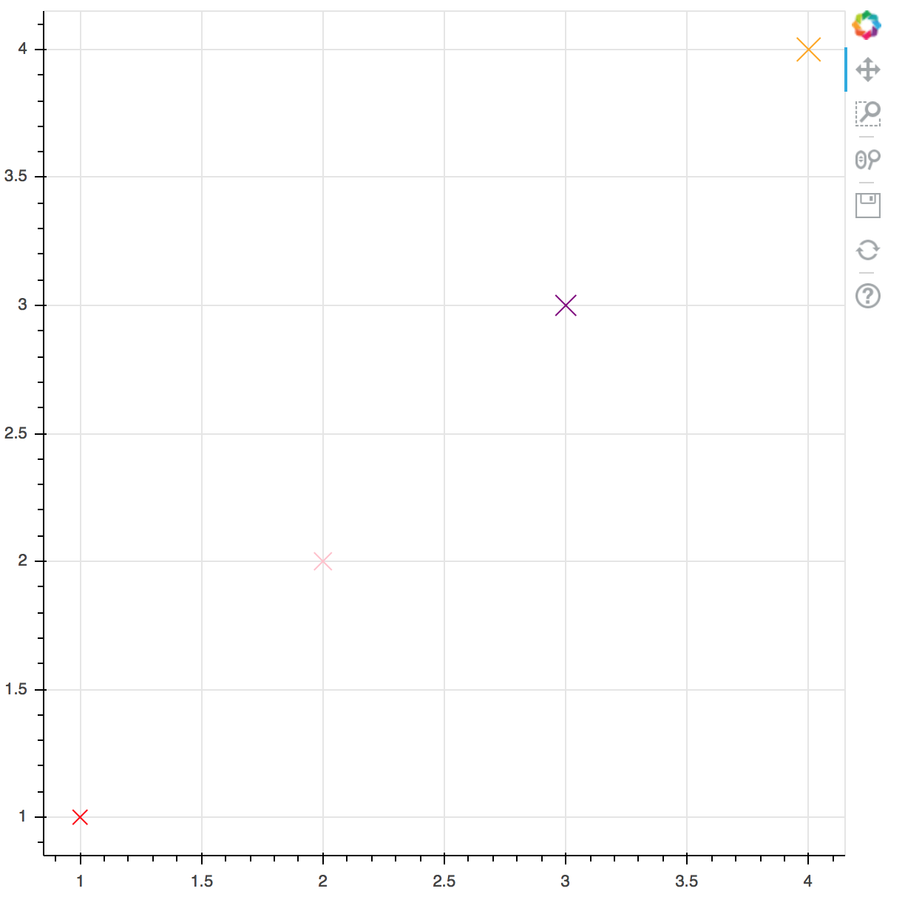 

Bokeh also has a built-in object called a `ColumnDataSource` which is used to map a python data object to JavaScript. This table-like data object maps string column names to sequences (columns) of data. `ColumnDataSource` object enforces that all columns are the same length. It can also be shared between different plots. ([**Bokeh documentation**](https://bokeh.pydata.org/en/latest/docs/user_guide/data.html#columndatasource))

The example below takes the DataFrame from above and uses it is the input to a `ColumnDataSource` object. Notice how the elements of the DataFrame are then referenced.

```
from bokeh.plotting import ColumnDataSource
source = ColumnDataSource(df)
plot = figure()
plot.x('x', 'y', color='color', size='size', source=source)
output_file('column_data_source_from_df.html')
show(plot)
```

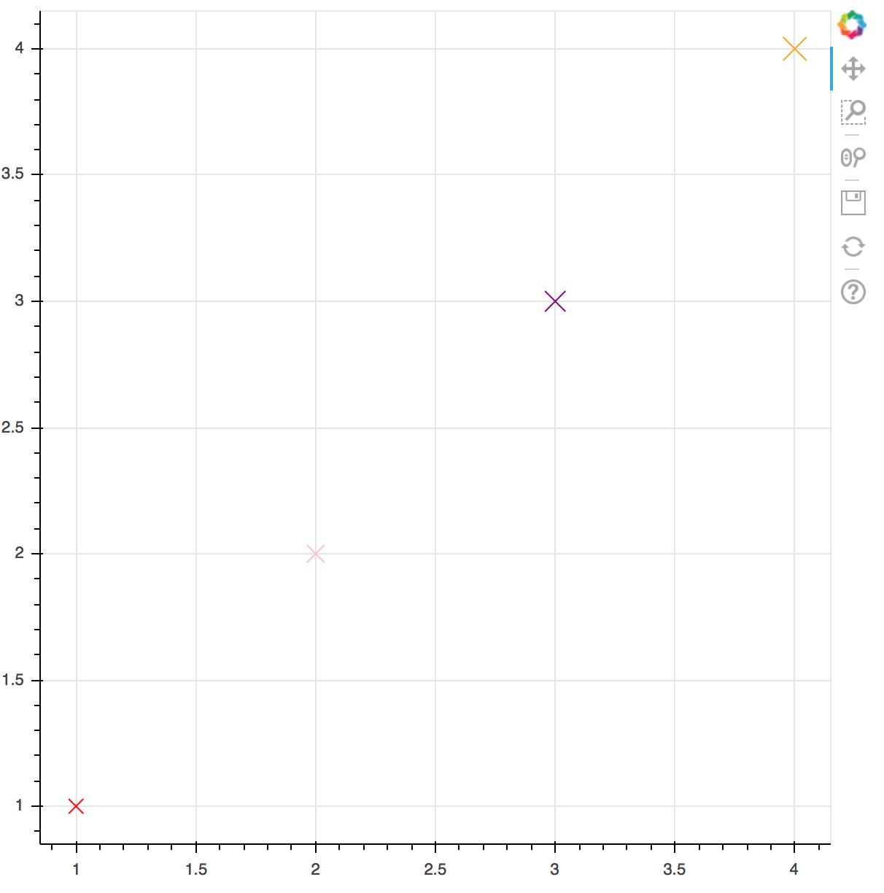 


## The `figure()` Object

In all the examples above, a `figure()` object was built before adding information to the visualization. In some of the examples, the parameters `plot_width` and `plot_height` were used to specify the width and height, respectively, of the figure in pixels. However, there are a host of other attributes that can be specified here as well.

The `figure()` object is a subclass of the Bokeh `Plot()` object, and therefore inherits [all of the attributes seen on this page](https://bokeh.pydata.org/en/latest/docs/reference/models/plots.html#bokeh.models.plots.Plot).

Additionally, all of the [figure() specific keyword arguments can be seen at the top of this page](https://bokeh.pydata.org/en/latest/docs/reference/plotting.html#bokeh.plotting.figure.Figure).

Some common attributes are:

* x_axis_label, x_axis_location, x_axis_type
* y_axis_label, y_axis_location, y_axis_type
* tools, toolbar, toolbar_location (*See [Configuring Plot Tools](https://bokeh.pydata.org/en/latest/docs/user_guide/tools.html) for more information*)
* title, title_location

A quick example:

```
plot = figure(x_axis_label='X Label',
    x_axis_type='datetime',
    x_axis_location='above',
    y_axis_label='Y Label',
    y_axis_type='datetime',
    y_axis_location='right',
    title='Example Figure',
    title_location='left',
    tools='save')
show(plot)
```

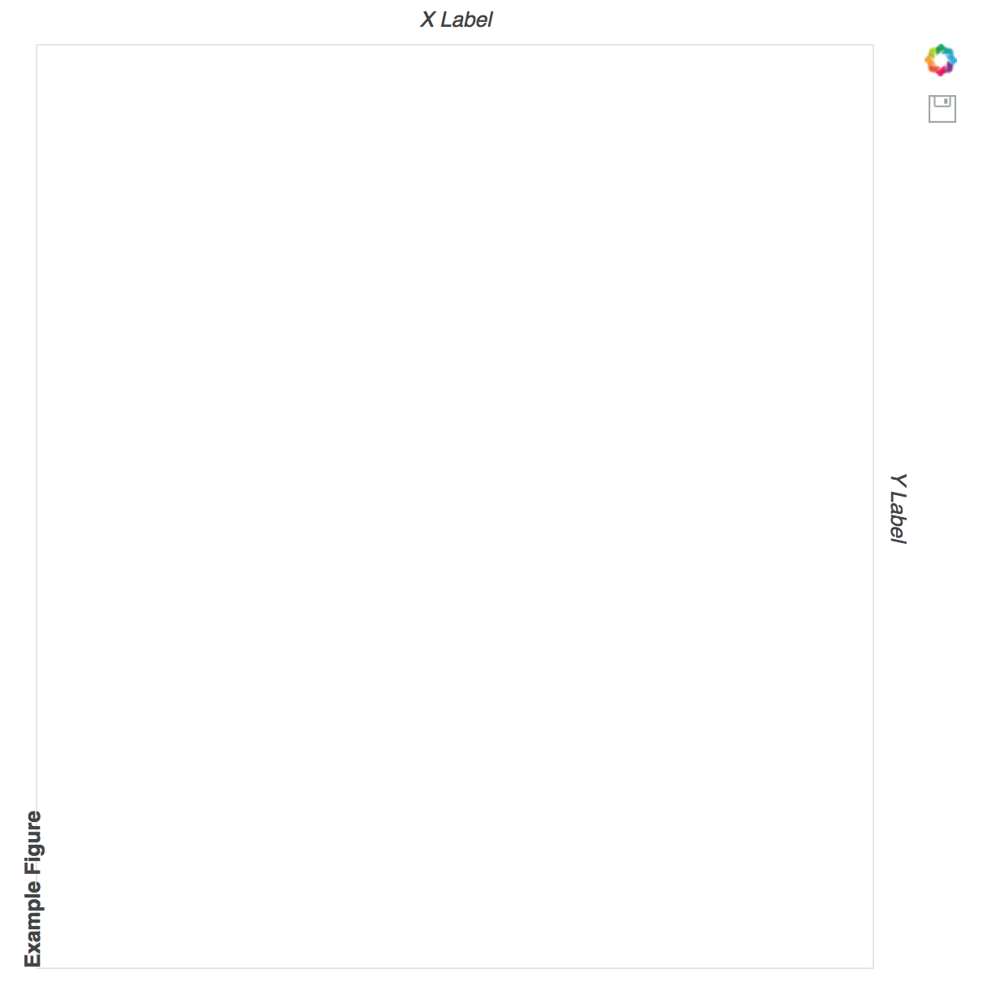 


## Basic Selection and Hover

Bokeh sets itself apart by supporting interactive visualization through the use of JavaScript and HTML. Two simple implementations of interaction are:

* Selection, and
* Hover

### Selection

Selection is enabled by adding tools in the creation of your figure. There are also specific attributes of the various glyphs outlined above that work specifically with selection.

```
from sklearn.datasets.samples_generator import make_blobs
X, y = make_blobs(n_samples=1000, centers=3, n_features=2, random_state=1)
plot = figure(x_axis_label='X', y_axis_label='Y', tools=['box_select', 'lasso_select', 'poly_select', 'reset'])
plot.circle(X[:,0], X[:,1], selection_color='grey', nonselection_color='lightblue', nonselection_alpha=0.5)
show(plot)
```

The graph below shows the blob in the upper right selected using the `box_select` tool. Additionally, the lasso_select and poly_select tools were added to the figure. All of these tool options were found on [this page](https://bokeh.pydata.org/en/latest/docs/user_guide/tools.html).

 

### Hover

Similar to Selection, there are tools that facilitate hover interaction - specifically `[HoverTool](https://bokeh.pydata.org/en/latest/docs/user_guide/tools.html#hovertool)`.

```
import numpy as np
x = np.linspace(0,3*np.pi,10000)
y = np.cos(x)

from bokeh.models import HoverTool
hover = HoverTool(tooltips=None, mode='vline')

plot = figure(x_axis_label='X', y_axis_label='COSINE(X)')
plot.add_tools(hover)
plot.circle(x, y, size=10, 
            fill_color='grey', alpha=0.1, line_color=None,
            hover_fill_color='firebrick', hover_alpha=0.5)
show(plot)
```

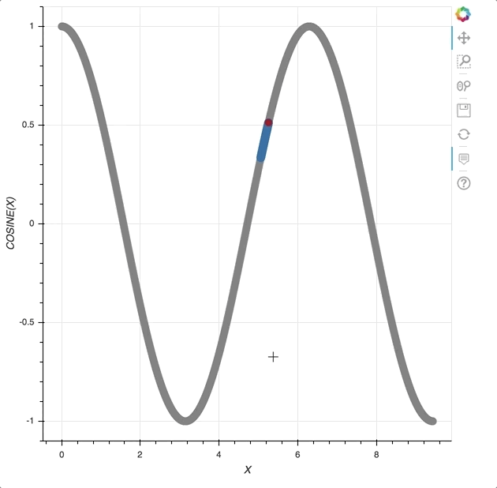 


### Hover Tooltips

The functionality above can be extended by passing information to the  `tooltips` parameter in the creation of the `HoverTool` object. The important thing to remember is that variables can be passed to the tooltip by using the `**@**` sign.

```
import pandas as pd
from bokeh.io import output_file, show
from bokeh.plotting import figure, reset_output, ColumnDataSource
from bokeh.models import HoverTool

data = [(1,1,'Point 1'), (2,2,'Point 2'), (3,3,'Point 3')]
df = pd.DataFrame(data, columns=['x','y','point_name'])
cds = ColumnDataSource(df)

hover = HoverTool(tooltips=[('X','@x'), 
                            ('Y','@y'), 
                            ('Name','@point_name')], 
                  mode='hline')

plot = figure()
plot.add_tools(hover)
plot.circle('x', 'y', source=cds, size=20)
show(plot)
```

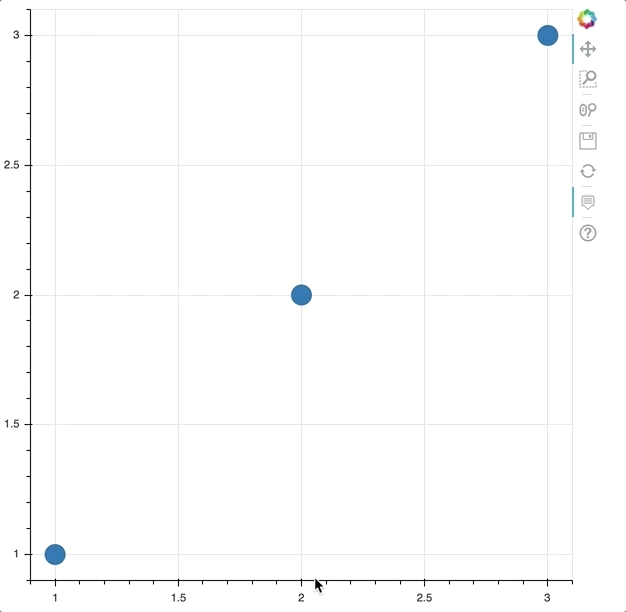 


Additionally the `**$**` character is reserved for built-in parameters that can be passed to `tooltips`. The [`HoverTool` documentation](https://bokeh.pydata.org/en/latest/docs/user_guide/tools.html#hovertool) has more information.

## Categorical Colormaps

Categorically labeled data can be automatically colored using Bokeh's `[CategoricalColorMapper](https://bokeh.pydata.org/en/latest/docs/reference/models/mappers.html#bokeh.models.mappers.CategoricalColorMapper)` object.

```
import numpy as np
import pandas as pd
from sklearn.datasets.samples_generator import make_blobs
X, y = make_blobs(n_samples=10000, centers=3, n_features=2, random_state=1)
df = pd.DataFrame(X, columns=['X','Y'])
df['cluster'] = y

def cluster_to_country(cluster):
    if cluster == 0:
        return 'USA'
    elif cluster == 1:
        return 'UK'
    else:
        return 'China'

df['country'] = df['cluster'].map(lambda x: cluster_to_country(x))
del df['cluster']

from bokeh.plotting import ColumnDataSource
from bokeh.models import CategoricalColorMapper
color_mapper = CategoricalColorMapper(factors=['USA', 'UK', 'China'],
                                      palette=['red', 'blue', 'yellow'])
source = ColumnDataSource(df)

plot = figure()
plot.square('X', 'Y', source=source,
    color=dict(field='country', transform=color_mapper),
    legend='country')    
show(plot)
```

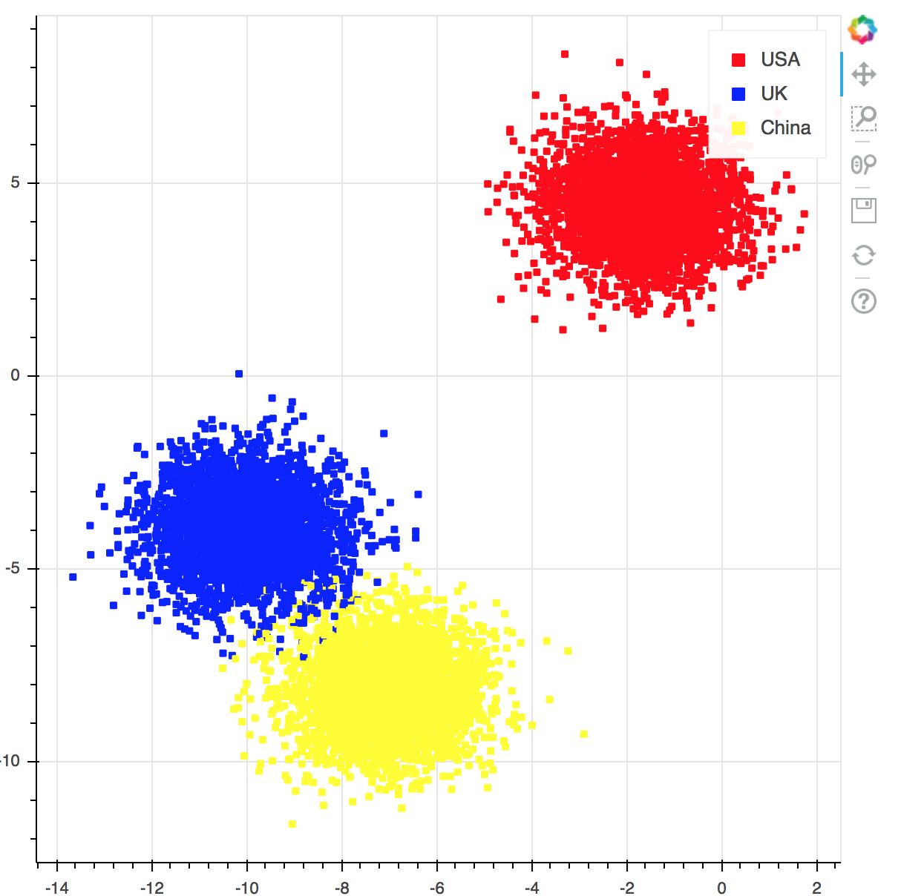 

## Configuring Layouts

plots and controls can be arranges visually on a page in

* rows and columns
* grids
* tabbed layouts

### Rows and Columns

Bokeh provides two objects in its `layouts` sub-module named `row` and `column`

```
from bokeh.layouts import row, column
```

each takes as input a set of plots, widgets, or even other layout objects from the `layouts` `sub-module` 

```
import numpy as np
import pandas as pd
from sklearn.datasets.samples_generator import make_blobs
X, y = make_blobs(n_samples=10000, centers=3, n_features=2, random_state=1)
df = pd.DataFrame(X, columns=['X','Y'])
df['cluster'] = y

# Separate the blobs into three separate DataFrames
df1 = df[df['cluster'] == 0]
df2 = df[df['cluster'] == 1]
df3 = df[df['cluster'] == 2]

from bokeh.io import output_file, show
from bokeh.plotting import figure, reset_output, ColumnDataSource
from bokeh.layouts import row, column
# Plot each DataFrame on its own figure
p1 = figure(plot_height=300, title='Blob 1')
p1.circle('X', 'Y', source=ColumnDataSource(df1), color='lightblue')

p2 = figure(plot_height=300, title='Blob 2')
p2.circle('X', 'Y', source=ColumnDataSource(df2), color='darkblue')

p3 = figure(plot_height=300, title='Blob 3')
p3.circle('X', 'Y', source=ColumnDataSource(df3), color='blue')

# Add each figure to layout
layout = row(column(p1, p2), p3)
show(layout)
```

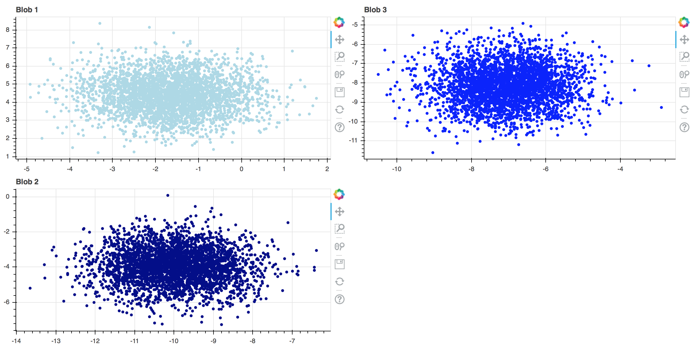 

### Gridplots

Alternatively to `row` and `column`, you can use a `gridplot` object (think `subplot` from `matplotlib`).

The `gridplot` object takes as parameters a list-of-lists, where each sub-list represents a row. It is recommended that each sub-list is of the same size, so to create something like the example created above, pass Python's `None` keyword where you do not want to plot anything. 

The primary advantage of the `gridplot` versus `row`/`column` is that everything within it shares a single toolbar.

Using the same data as the previous example:

```
import numpy as np
import pandas as pd
from sklearn.datasets.samples_generator import make_blobs
X, y = make_blobs(n_samples=10000, centers=3, n_features=2, random_state=1)
df = pd.DataFrame(X, columns=['X','Y'])
df['cluster'] = y

# Separate the blobs into three separate DataFrames
df1 = df[df['cluster'] == 0]
df2 = df[df['cluster'] == 1]
df3 = df[df['cluster'] == 2]

from bokeh.io import output_file, show
from bokeh.plotting import figure, reset_output, ColumnDataSource
from bokeh.layouts import row, column
# Plot each DataFrame on its own figure
p1 = figure(plot_height=300, title='Blob 1')
p1.circle('X', 'Y', source=ColumnDataSource(df1), color='lightblue')

p2 = figure(plot_height=300, title='Blob 2')
p2.circle('X', 'Y', source=ColumnDataSource(df2), color='darkblue')

p3 = figure(plot_height=300, title='Blob 3')
p3.circle('X', 'Y', source=ColumnDataSource(df3), color='blue')

from bokeh.layouts import gridplot
# Create the gridplot 
layout = gridplot([p1, p3], [p2, None])
show(layout)
```

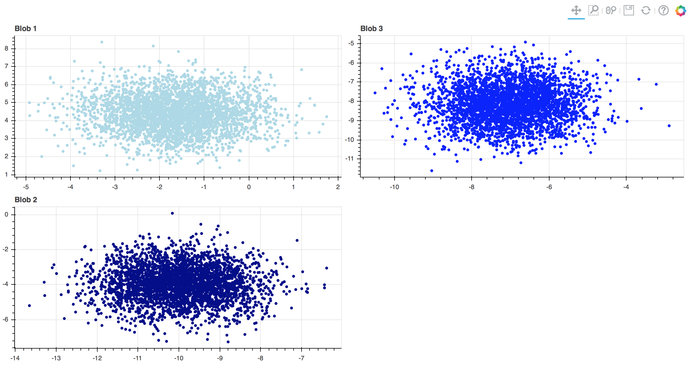 

### Tabbed Layouts

Bokeh makes it super-easy to separate plots on individual tabs. Doing so requires two Bokeh widgets - `Tab` and `Panel`.

Each `Panel` object holds the plots to be contained within its tab. Each `Tab` object takes as input a list of `Panel` objects.

Again, re-using the data from above:

```
import numpy as np
import pandas as pd
from sklearn.datasets.samples_generator import make_blobs
X, y = make_blobs(n_samples=10000, centers=3, n_features=2, random_state=1)
df = pd.DataFrame(X, columns=['X','Y'])
df['cluster'] = y

# Separate the blobs into three separate DataFrames
df1 = df[df['cluster'] == 0]
df2 = df[df['cluster'] == 1]
df3 = df[df['cluster'] == 2]

from bokeh.io import output_file, show
from bokeh.plotting import figure, reset_output, ColumnDataSource
from bokeh.layouts import row, column
# Plot each DataFrame on its own figure
p1 = figure(plot_height=300)
p1.circle('X', 'Y', source=ColumnDataSource(df1), color='lightblue')

p2 = figure(plot_height=300)
p2.circle('X', 'Y', source=ColumnDataSource(df2), color='darkblue')

p3 = figure(plot_height=300)
p3.circle('X', 'Y', source=ColumnDataSource(df3), color='blue')

from bokeh.models.widgets import Tabs, Panel
# Put each blob on it's own tab
panel1 = Panel(child=p1, title='Blob 1')
panel2 = Panel(child=p2, title='Blob 2')
panel3 = Panel(child=p3, title='Blob 3')
tabs = Tabs(tabs=[panel1, panel2, panel3])
show(tabs)
```

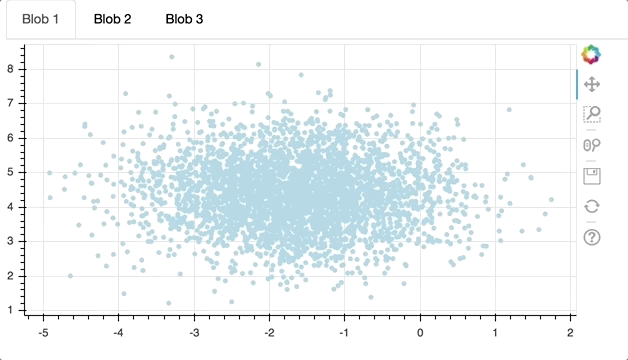 

Note that the *child* parameter passed to the `Panel` object also accepts other layout objects (`row`, `column`, `gridplot`), etc.

## Linking Plots Together

### Linking Axes

Elements of different plots can be easily linked together, for instance axes can quickly be linked by setting them equal to one another. This means that by moving an axes on any plot shown (via the pan tool), all three will move in accordance:

```
import numpy as np
import pandas as pd
from sklearn.datasets.samples_generator import make_blobs
X, y = make_blobs(n_samples=10000, centers=3, n_features=2, random_state=1)
df = pd.DataFrame(X, columns=['X','Y'])
df['cluster'] = y

# Separate the blobs into three separate DataFrames
df1 = df[df['cluster'] == 0]
df2 = df[df['cluster'] == 1]
df3 = df[df['cluster'] == 2]

from bokeh.io import output_file, show
from bokeh.plotting import figure, reset_output, ColumnDataSource
from bokeh.layouts import row, column
# Plot each DataFrame on its own figure
p1 = figure(plot_height=300, plot_width=300)
p1.circle('X', 'Y', source=ColumnDataSource(df1), color='lightblue')

p2 = figure(plot_height=300, plot_width=300)
p2.circle('X', 'Y', source=ColumnDataSource(df2), color='darkblue')

p3 = figure(plot_height=300, plot_width=300)
p3.circle('X', 'Y', source=ColumnDataSource(df3), color='blue')

from bokeh.layouts import row
# Arrange the three plots in a single row
# and link the axes
layout = row(p1, p2, p3)
p1.x_range = p2.x_range = p3.x_range
p1.y_range = p2.y_range = p3.y_range
show(layout)
```

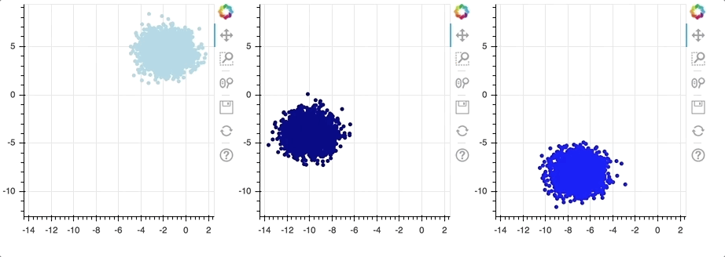 

### Linking Selections

Using `ColumnDataSource` enables easy setup of linked selection - where selecting information on one plot will select and highlight connected information on a different plot. 

```
import numpy as np
import pandas as pd
from sklearn.datasets.samples_generator import make_blobs
X, y = make_blobs(n_samples=10000, centers=2, n_features=4, random_state=1)
df = pd.DataFrame(X, columns=['W','X','Y','Z'])
df['cluster'] = y


from bokeh.io import output_file, show
from bokeh.plotting import figure, reset_output, ColumnDataSource
from bokeh.layouts import gridplot
# Create ColumnDataSource from DataFrame
data = ColumnDataSource(df)

# Create the figures and add to layout
p1 = figure(plot_height=300, plot_width=300, title='W vs. X', tools=['box_select', 'reset'])
p1.circle('W', 'X', source=data, color='lightblue')
p2 = figure(plot_height=300, plot_width=300, title='Y vs. Z', tools=['box_select', 'reset'])
p2.circle('Y', 'Z', source=data, color='darkblue')

layout = gridplot([[p1, p2]], toolbar_location='left')
show(layout)
```

 

## Legends

The example above could definitely use a legend. This can be added inside the glyph method - the `circle()` method in the above case. More information about legends can be found [here](https://bokeh.pydata.org/en/latest/docs/user_guide/annotations.html#legends).

### Basic

```
import numpy as np
import pandas as pd
from sklearn.datasets.samples_generator import make_blobs
X, y = make_blobs(n_samples=10000, centers=2, n_features=2, random_state=1)
df = pd.DataFrame(X, columns=['W','X'])
df['cluster'] = y
df['cluster'] = df['cluster'].map(lambda x: 'data scientist' if x == 0 else 'data analyst')

from bokeh.io import output_file, show
from bokeh.plotting import figure, reset_output
from bokeh.models import CategoricalColorMapper
# Create ColumnDataSource from DataFrame
data = ColumnDataSource(df)

mapper = CategoricalColorMapper(factors=['data scientist', 'data analyst'], palette=['orange', 'firebrick'])

p1 = figure(plot_height=300, plot_width=300, title='W vs. X', tools=['box_select', 'reset'])
p1.circle('W', 'X', legend='cluster', source=data, color=dict(field='cluster', transform=mapper), alpha=0.5)
p1.legend.location = 'top_left'
show(p1)
```

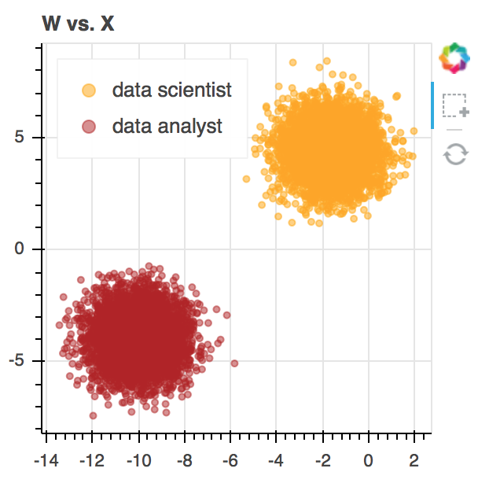 

### Interactive

Adding interactive to functions is done similarly to how the position was specified above. Two options are to hide and mute upon clicking an element of the legend. Documentation on interactive legends can be found [here](https://bokeh.pydata.org/en/latest/docs/user_guide/interaction/legends.html#userguide-interaction-legends). 

```
import numpy as np
import pandas as pd
from sklearn.datasets.samples_generator import make_blobs
from bokeh.io import output_file, show
from bokeh.plotting import figure, reset_output
from bokeh.models import CategoricalColorMapper
from bokeh.layouts import row

X, y = make_blobs(n_samples=10000, centers=2, n_features=2, random_state=1)
df1 = pd.DataFrame(X, columns=['W','X'])
df1['cluster'] = y
df1['cluster'] = df1['cluster'].map(lambda x: 'data scientist' if x == 0 else 'data analyst')

dfDA = df1[df1['cluster'] == 'data analyst']
dfDS = df1[df1['cluster'] == 'data scientist']

# Create the figures and add to layout
p1 = figure(plot_height=400, plot_width=400, title='Click legend to **HIDE** data')
p1.circle(dfDA['W'], dfDA['X'], legend='data analyst', alpha=0.5)
p1.square(dfDS['W'], dfDS['X'], legend='data_scientist', alpha=0.5)
p1.legend.location = 'top_left'
**p1.legend.click_policy="hide"**

p2 = figure(plot_height=400, plot_width=400, title='Click legend to **MUTE** data')
p2.circle(dfDA['W'], dfDA['X'], legend='data analyst', alpha=0.5, **muted_alpha****=0.2**)
p2.square(dfDS['W'], dfDS['X'], legend='data_scientist', alpha=0.5, **muted_alpha****=0.2**)
p2.legend.location = 'top_left'
**p2.legend.click_policy="mute"**

layout = row(p1, p2)
show(layout)
```

*Note the passing of the `muted_alpha` parameter when `legend.click_policy=”mute”`*

 
