# Getting Started with Interactive Data Visualization Using Bokeh

Bokeh prides itself on being a library for _interactive_ data visualization. Unlike popular counterparts in the Python visualization space like ```matplotlib``` and ```seaborn```, Bokeh renders its graphics using HTML and Javascript. While this makes it a great candidate for building web-based dashboards and applications, it is an equally powerful tool for exploring and understanding your data or creating beautiful custom charts for a project or report.  

Using a number of examples on a real-world dataset, the goal of this tutorial is to get you up and running with Bokeh and by the end you will:

* feel comfortable using Bokeh to go from data to visualization
* be able to create and customize common charts and configure layouts from the ground up
* understand how to leverage Bokeh's ability to add interactive elements to your visualizations

So let's jump in ... 


## From Data to Visualization

The general Bokeh workflow can be outlined as follows:

**Prepare The Data**

Any good data visualization starts with, you guessed it - data. I will assume that you have a basic knowledge of handling data in Python, and if not feel free to check out the [growing number of excellent RealPython tutorials on the subject](https://realpython.com/tutorials/data-science/). This step commonly involves data handling libraries like ```pandas``` or ```numpy```  and is all about taking the required steps to transform it into a form that is best suited for your intended visualization. 

**Determine Where The Visualization Will Be Rendered** 

From there, determine how you want to generate and ultimately view your visualization. The primary option is to generate an HTML file. However, Bokeh also makes it extremely easy to render your visualization right in a Jupyter notebook.

**Set Up The Figure(s)**

From here you will assemble your figure, preparing the canvas for your visualization. It is this step in which you can customize everything from the titles to the tick marks. Additionally, it is at this step where you can set up a suite of tools that can be leveraged in interacting with your plot - hover actions, selection options, etc. 

**Connect To and Draw Your Data**

Next you will utilize Bokeh's multitude of renderers to give shape to your data. Here you have the flexibility to draw your data from scratch using the many available glyph options - all of which are easily customizable. While drawing visualizations from scratch may sound scary, Bokeh has some built-in functionality for building things like [stacked bar charts](https://bokeh.pydata.org/en/latest/docs/user_guide/categorical.html#stacked) or examples for creating more advanced visualizations like [network graphs](https://bokeh.pydata.org/en/latest/docs/user_guide/graph.html) and [maps](https://bokeh.pydata.org/en/latest/docs/user_guide/geo.html).

**Organize the Layout**

If you need more than one figure to express your data, no big deal. Not only does Bokeh offer the standard grid-like layout options, but also allows you to easily organize your visualizations into a tabbed layout in just a few lines of code. Additionally, your plots can be quickly linked together so a selection on one will be reflected on any combination of the others. 

**Preview and Save Your Beautiful Data Creation**

Finally, it is time to see what you created. At this stage you can take a look at your work, test all of the interactive elements implemented, and export your new creation to an image file. 

That's it! Those six steps yields a tidy, flexible template for taking your data to from the table to the big screen. The code skeleton will generally look something like the following, and as I move through the steps in more detail you will see how this skeleton is filled in. 

```python
""" Bokeh Visualization Template

This template is a general outline for turning your data into a 
visualization using Bokeh.
"""
# Data Handling
import pandas as pd
import numpy as np

# Bokeh Libraries
from bokeh.io import output_file, output_notebook
from bokeh.plotting import figure, show
from bokeh. models import ColumnDataSource
from bokeh.layouts import row, column, gridplot
from bokeh.models.widgets import Tabs, Panel

# Prepare the Data

# Determine where the visualization will be rendered
output_file(filename) # Render to static HTML, or 
output_notebook() # Render inline in a Jupyter Notebook

# Set Up the figure(s)
fig = figure() # Instantiate a figure() object

# Connect to and draw the data

# Organize the layout

# Preview and save 
show(fig) # See what I made, and save if I like it
```


## Generating Your First Figure 

The ```bokeh.io``` module offers two options for outputting your visualization:

* **```output_file(filename)```** will write the visualization to a static HTML file
* **```output_notebook()```** will render your visualization directly in a Jupyter notebook

It is important to note that neither function will actually show you the the visualization. That doesn't happen until the ```show()``` function is called. However, they will ensure that when ```show()``` is called the visualization appears where you intend it to.

This is a great opportunity to give you your first glimpse at a default Bokeh ```figure()```. Running the template code from above will do just this. First using ```output_file()```:

```python
# Bokeh Libraries
from bokeh.io import output_file
from bokeh.plotting import figure, show

# The figure will be rendered in a static HTML file called output_file_test.html
output_file('output_file_test.html', title='Empty Bokeh Figure')

# Set up a generic figure() object
fig = figure()

# See what it looks like
show(fig)
```

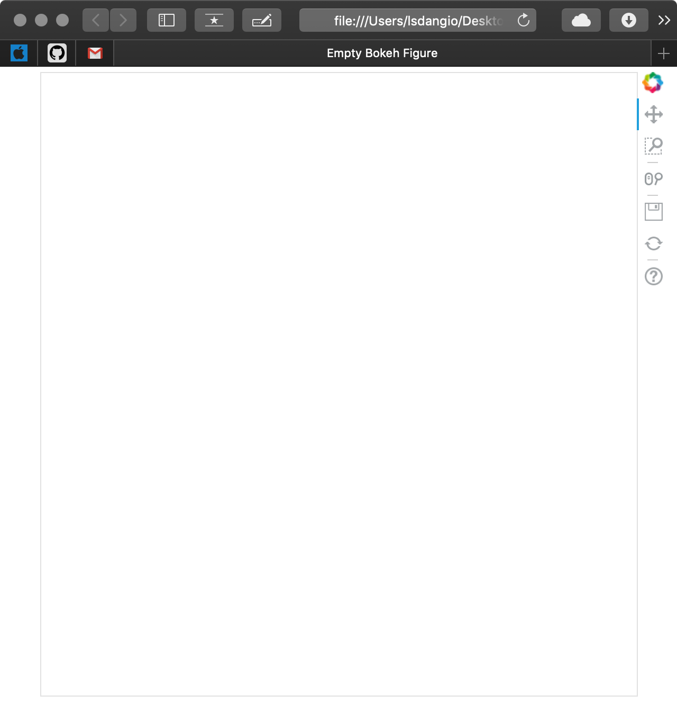 

As you can see, a new browser window opened with a tab called _Empty Bokeh Figure_ and an empty figure. Not shown is the file generated with the name _output_file_test.html_. This is based on the parameters passed to ```output_file()```.

If I run the same code snippet with ```output_notebook()``` in place out ```output_file()```,  assuming I have a Jupyter Notebook fired up and ready to go, I will get the following:

```python
# Bokeh Libraries
from bokeh.io import output_notebook
from bokeh.plotting import figure, show

# The figure will be right in my Jupyter Notebook
output_notebook()

# Set up a generic figure() object
fig = figure()

# See what it looks like
show(fig)
```

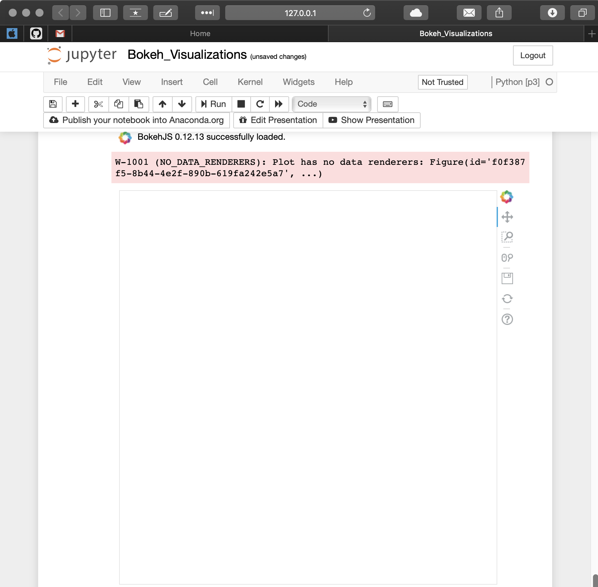

Same result, just rendered in a different location. 

More information about both ```output_file()``` and ```output_notebook()``` can be found in the [Bokeh official docs](https://bokeh.pydata.org/en/latest/docs/reference/io.html#bokeh-io-output).

----

#### TIP: Rendering Multiple Visualizations in the Notebook

Sometimes when rendering multiple visualizations sequentially in a Jupyter Notebook you may see that past renders are not being cleared with each execution. If you experience this, import and run the following between executions:

```python
from bokeh.plotting import reset_output
reset_output()
```

-----

Before moving on, you may have noticed that the default Bokeh figure comes pre-loaded with a toolbar. This is an important sneak preview into the interactive elements of Bokeh that come right out of the box. You'll find out more about the toolbar and how to configure it later in the tutorial. 


## Getting Your Figure Ready for Data

You now know how to create and view a generic Bokeh figure either in a browser or Jupyter Notebook. The ```figure()``` object is the canvas for which you will create your data visualization - making configuring it properly essential! 

The ```figure()``` object is not only the foundation of your data visualization, it is also the object that unlocks all of Bokeh's available tools for visualizing data (don't worry, you'll learn about those next). A subclass of [Bokeh's Plot() object](https://bokeh.pydata.org/en/latest/docs/reference/models/plots.html#bokeh.models.plots.Plot), the Bokeh figure inherits all of its attributes. This makes it possible to configure all of the critical aspects of the figure - titles; axis labels, locations, ticks, and types; dimensions; tools and more. 

To show you just a glimpse into the customization options available, I'll make the ugliest figure ever:

```python
# Bokeh Libraries
from bokeh.io import output_notebook
from bokeh.plotting import figure, show

# The figure will be right in my Jupyter Notebook
output_notebook()

# Example figure
fig = figure(
    background_fill_color='gray',
    background_fill_alpha=0.5,
    border_fill_color='blue',
    border_fill_alpha=0.25,
    plot_height=300,
    plot_width=500,
    h_symmetry=True,
    x_axis_label='X Label',
    x_axis_type='datetime',
    x_axis_location='above',
    x_range=('2018-01-01','2018-06-30'),
    y_axis_label='Y Label',
    y_axis_type='linear',
    y_axis_location='left',
    y_range=(0,100),
    title='Example Figure',
    title_location='right',
    toolbar_location='below',
    tools='save')

# See what it looks like 
show(fig)
```

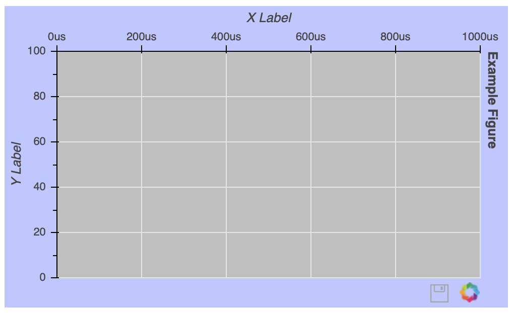

Once the ```figure()``` object is instantiated, you can still configure it after the fact. 

So if I want to get rid of those gridlines:

```python
# Remove the gridlines from the figure() object
fig.grid.grid_line_color = None

# Change the x-axis type to linear
fig.show()
```

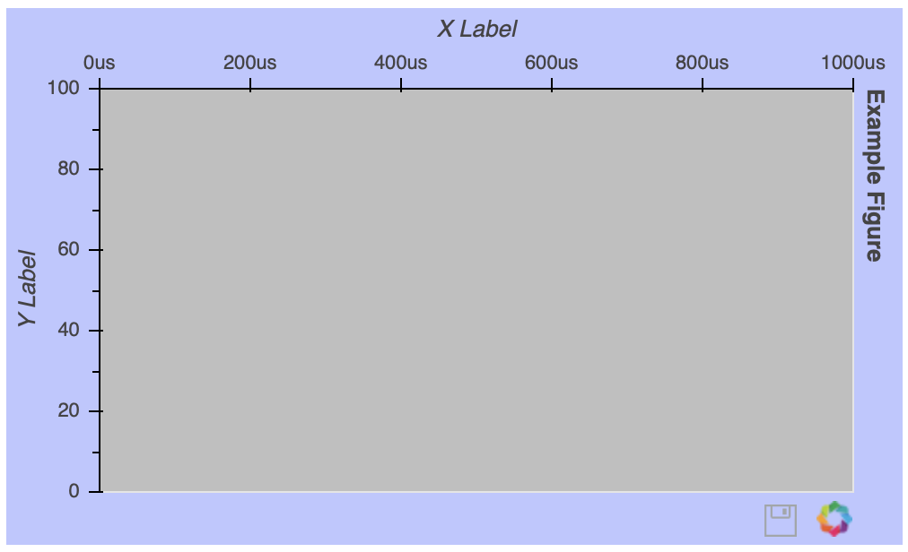

With so many customizable elements, If you are working in a Notebook or in an IDE with auto-complete - this feature is your friend! Otherwise, doing a quick web search with the keyword _bokeh_ and what you are trying to do will generally point you in the right direction. 


There is tons more I could touch on here, but don't feel like you're missing out. I'll make sure to introduce different figure tweaks as the tutorial progresses. Still worried? Check out [the excellent Bokeh User Guide](https://bokeh.pydata.org/en/latest/docs/user_guide/styling.html#text-properties) or go straight to the source:

* **[The Bokeh Plot Class](https://bokeh.pydata.org/en/latest/docs/reference/models/plots.html#bokeh.models.plots.Plot)** The superclass of the ```figure()``` object and where figures inherit a lot of their attributes 
* **[The ```figure()``` Method](https://bokeh.pydata.org/en/latest/docs/reference/plotting.html#bokeh.plotting.figure.Figure)** Checkout the keywords args towards the top of the page, they should look familiar

Additionally, here are a few specific customization tools worth checking out:

* [**Text Properties**](https://bokeh.pydata.org/en/latest/docs/user_guide/styling.html#text-properties) all the attributes related to changing font styles, sizes, colors, etc.
* [**TickFormatters**](https://bokeh.pydata.org/en/latest/docs/user_guide/styling.html#tick-label-formats) a built-in object specifically for formatting your axes using Python-like string formatting syntax 


## Drawing Data with Glyphs

Now the fun really begins. But before we jump in, it is probably a good call out to remind you that Bokeh visualizations - unlike those created  ```matplotlib``` and ```seaborn``` - are not ready-made versions of the charts you are used to seeing. That brings us to glyphs, the building blocks of Bokeh visualizations. Glyph is essentially a fancy word for shape, and after you create your figure you are given access to [a bevy of these configurable shapes](https://bokeh.pydata.org/en/latest/docs/reference/plotting.html) to create the visualization of your dreams:

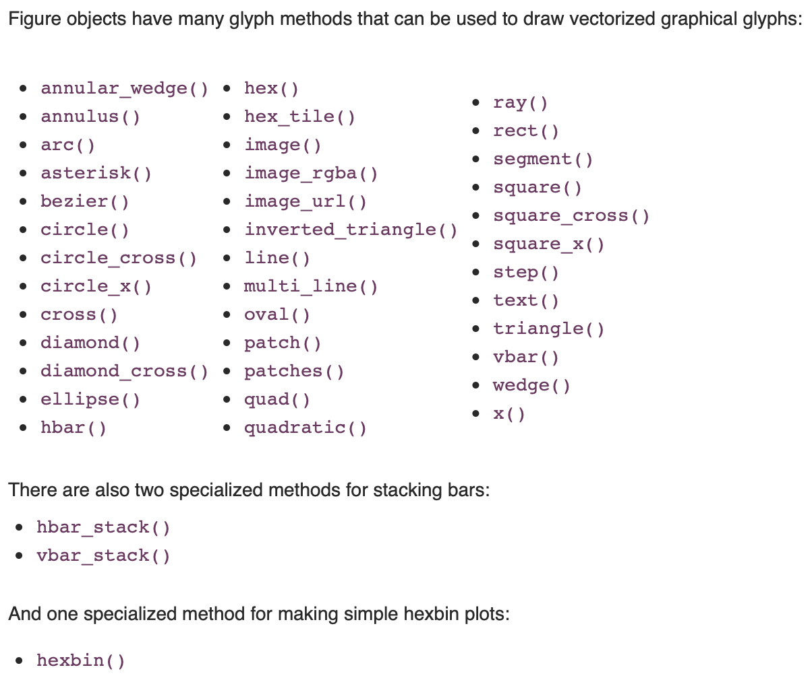

Now this may sound scary, building everything from scratch, but you will be surprised with the freedom it opens up in making not only the usual charts and graphs but also truly unique and elegant data visualizations.

Let's start with a very basic example. I want to draw some points on an x-y coordinate grid:

```python
reset_output()

# Bokeh Libraries
from bokeh.io import output_notebook
from bokeh.plotting import figure, show

# My x-y coordinate data
x = [1, 2, 1]
y = [1, 1, 2]

# Output the visualization directly in the notebook
output_notebook()

# Create a figure called 'My Coordinates' with no toolbar and axis ranges of [0,3]
fig = figure(
    title='My Coordinates',
    plot_height=300,
    plot_width=300,
    x_range=(0,3),
    y_range=(0,3),
    toolbar_location=None)

# Draw the coordinates as circles
fig.circle(
    x=x,
    y=y,
    color='green',
    size=10,
    alpha=0.5)

# Show plot
show(fig)
```

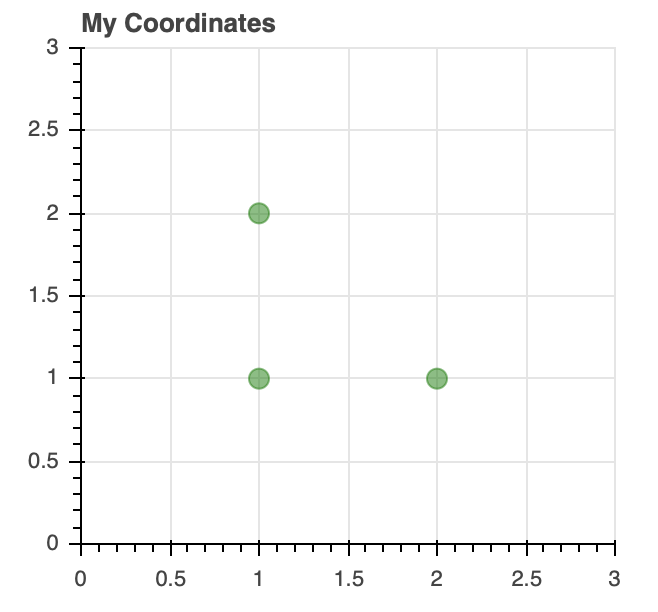

Notice that I hid the toolbar by setting the ```toolbar_location``` property to ```None``` in the figure instantiation. 

```circle()```, along with glyphs like ```diamond()```, ```square()```,``` triangle()```, and ```x()```,  are examples of a scatter markers - as you can image they would be useful in creating scatter plot and bubble charts. Another glyph classication includes single (```line()```), step (```step()```), and multiple (```multi_line()```) lines - all of which are line glyphs - your go to for line charts . Bar/rectangle glyphs (```quad()```, ```vbar()```, ```hbar()```) are the building blocks of histograms, bar/column, waterfall, and even gantt charts. Everything you need to know to familiarize yourself with all of Bokeh's glyph offerings is outlined in [the Reference Guide](https://bokeh.pydata.org/en/latest/docs/user_guide/plotting.html). 

These glyphs can be mix-and-matched to your visualization's needs. Let's say I want to create a visualization that shows how many words I wrote per day to make this tutorial with a trend line of the cumulative words overlaid:

```python
# Pandas and Numpy for generating my dummy data
import pandas as pd
import numpy as np

# Bokeh Libraries
from bokeh.io import output_notebook
from bokeh.plotting import figure, show

# My word count data
dayNum = np.linspace(1,10,10)
dailyWords = [450, 628, 488, 210, 287, 791, 508, 639, 397, 943]
cumWords = np.cumsum(dailyWords)

# Output the visualization directly in the notebook
output_notebook()

# Create a figure with a datetime type x-axis
fig = figure(
    title='My Tutorial Progress',
    plot_height=400,
    plot_width=700,
    x_axis_label='Day Number',
    y_axis_label='Words Written',
    x_minor_ticks=2,
    y_range=(0,6000),
    toolbar_location=None)

# The daily words will be represented as vertical bars (columns)
fig.vbar(
    x=dayNum, 
    bottom=0, 
    top=dailyWords, 
    color='#51B2E8',
    width=0.75,
    legend='Daily')

# The cumulative sum will be a trend line
fig.line(
    x=dayNum,
    y=cumWords, 
    line_width=1,
    color='#23223E',
    legend='Cumulative')

# Put the legend in the upper left corner
fig.legend.location = 'top_left'

# Let's check it out
show(fig)
```

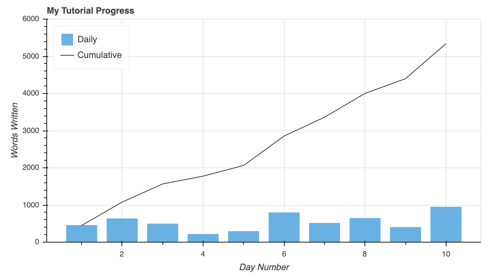

Instead of using explicit color names as in previous examples, this time I took advantage of glyphs being able to interpret [hex color values](https://htmlcolorcodes.com). Also, this is the first time I've shown you how seamlessly a legend can be created by simply setting the ```legend``` property for each glyph. The legend was then moved to the upper left corner of the plot by assigning ```'top_left'``` to ```fig.legend.location```. Much more [detail about styling legends can be found here](https://bokeh.pydata.org/en/latest/docs/user_guide/styling.html#legends). Clifferhanger: they will show up again later in the tutorial when we start digging into interactive elements of the visualization. 


## A Quick Aside About Data

Anytime you are exploring a new visualization library, it is a good idea to start with some data in a domain you are familiar enough with to be able to express it visually. The beauty of a package as flexible as Bokeh is that nearly any idea you have should be possible, its just a matter of how you want to leverage the avaialble tools to do so. 

With that said, as I take you through filling out the template above I will be using publically-available data from Kaggle that has information about [the National Basketball Association's (NBA) 2017-18 season](https://www.kaggle.com/pablote/nba-enhanced-stats). I will be hopping around between three datasets - one that holds game-by-game snapshots of player statistics, one that holds game-by-game snapshots of team statistics, and one that holds daily team standings and rankings. 

This data has nothing to do with what I do for work, but I love basketball and am always thinking about ways to visualize the ever-growing amount of data associated with it. If you don't have data to play with from school or work, think about something you are interested in and try to find some data for that. It will go a long way in making both the learning and creative process more enjoyable! 


## Using the ColumnDataSource Object

You are ready to get your hands on some real data. The examples above used Python lists and Numpy arrays to represent the data and Bokeh is well equipped to handle these datatypes. However when it comes to data in Python you are most likely going to come across Python dictionaries and ```pandas``` ```DataFrame```s, especially if you are reading in data from a file or external data source. As you can imagine, Bokeh is well equipped to work with these more complex data structures and even has built-in functionality to handle them - namely the ```ColumnDataSource```.

So the first question you may have is - _why use a ```ColumnDataSource``` when Bokeh can interface with other data types directly?_ For one, whether you reference a list, array, dictionary, or DataFrame directly when building your visualization, Bokeh is going to turn it into a ```ColumnDataSource``` behind the scenes anway. More importantly, as you'll see ```ColumnDataSource``` make it much easier to implement the Bokeh's interactive affordances. 

The ```ColumnDataSource``` is foundational in passing the data to the glyphs you are using to visualize. It's primary functionality is to map names to the columns of your data. This makes it easier for you to reference elements of your data when building your visualization, and easier for Bokeh to to the same when building your vizualization. 

```ColumnDataSource``` can be passed three forms of data:

* **Python ```dict```** where the keys are names associated with the respective value sequences (ie. lists, arrays, etc.)
* **Pandas ```DataFrame```** where the columns of the ```DataFrame``` become the reference names for the ```ColumnDataSource```
* **Pandas ```groupby```** where the columns of the ```ColumnDataSource``` reference the columns as seen by calling ```groupby.describe()```

Let's see it in action.

I want to visualize the race for first place in the NBA's Western Conference in 2017-18 between the defending-champion Golden State Warriors and the challenger Houston Rockets. I have stored the daily win-loss records of these two teams in a ```DataFrame``` named ```westTop2```:

```Python
# Data Handling Libraries
import pandas as pd
import numpy as np

# Read in the standings dataset
standings = pd.read_csv('2017-18_standings.csv')

# Convert stDate column to datetime
standings['stDate'] = pd.to_datetime(standings['stDate'])

# Isolate the daily win totals for the Warriors and Rockets
westTop2 = standings[(standings['teamAbbr'] == 'HOU') | (standings['teamAbbr'] == 'GS')]\
           .loc[:,['stDate', 'teamAbbr', 'gameWon']]\
           .sort_values(['teamAbbr','stDate'])
      
# Preview the DataFrame
westTop2.head()
```

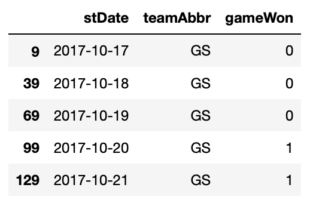

From here I can load this ```DataFrame``` into a ```ColumnDataSource``` and visualize the race:

```python
# Bokeh libraries
from bokeh.plotting import figure, show
from bokeh.io import output_notebook
from bokeh.models import ColumnDataSource

# Output inline in the notebook
output_notebook()

# Create a ColumnDataSource 
rockets = ColumnDataSource(westTop2[westTop2['teamAbbr'] == 'HOU'])
warriors = ColumnDataSource(westTop2[westTop2['teamAbbr'] == 'GS'])

# Create and configure the figure
fig = figure(x_axis_type="datetime", 
             plot_height=300,
             plot_width=600,
             title="Western Conference Top 2 Teams Wins Race, 2017-18",
             toolbar_location=None)

# Add axis labels
fig.xaxis.axis_label = 'Date'
fig.yaxis.axis_label = 'Wins'

# Render the race as step lines
fig.step('stDate', 'gameWon', color='#CC0000', legend='Rockets', source=rockets)
fig.step('stDate', 'gameWon', color='#223E91', legend='Warriors', source=warriors)

# Move the legend to the upper left corner
fig.legend.location = "top_left"

# Show the plot
show(fig)
```

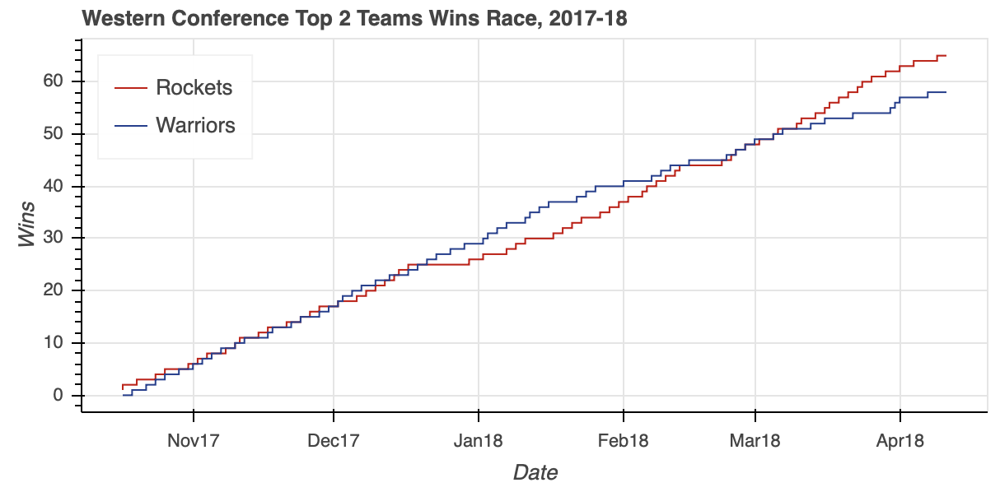

I like it! It was definitely a tight race throughout the season, with the Warriors building a pretty big cushion around the middle of the season. However a bit of a late-season slide allowed the Rockets to catch up and ultimately surpass the defending champs to finish the season as the Western Conference number-one seed. 

Notice how the respective ```ColumnDataSource``` objects are referenced when creating the two lines. I simplied passed the original column names as input parameters and specified which ```ColumnDataSource``` to use via the ```source``` property. 

```ColumnDataSource``` objects can do more than just serve as easy way to reference ```DataFrame``` columns. To illustrate another functionality of the ```ColumnDataSource```, I am going to make a small tweak to the code snippet above:

```python
# Bokeh libraries
from bokeh.plotting import figure, show
from bokeh.io import output_notebook
from bokeh.models import ColumnDataSource, CDSView, GroupFilter

# Output inline in the notebook
output_notebook()

# Create a ColumnDataSource 
cds = ColumnDataSource(westTop2)

# Create views for each team
rocketsView = CDSView(source=cds, 
                      filters=[GroupFilter(column_name='teamAbbr', group='HOU')])
warriorsView = CDSView(source=cds, 
                      filters=[GroupFilter(column_name='teamAbbr', group='GS')])

# Create and configure the figure
westFig = figure(x_axis_type="datetime", 
                 plot_height=300,
                 plot_width=600,
                 title="Western Conference Top 2 Teams Wins Race, 2017-18",
                 toolbar_location=None)

# Add axis labels
westFig.xaxis.axis_label = 'Date'
westFig.yaxis.axis_label = 'Wins'

# Render the race as step lines
westFig.step('stDate', 'gameWon', color='#CC0000', legend='Rockets', 
             source=cds, view=rocketsView)
westFig.step('stDate', 'gameWon', color='#223E91', legend='Warriors', 
             source=cds, view=warriorsView)

# Move the legend to the upper left corner
westFig.legend.location = "top_left"

# Show the plot
show(westFig)
```

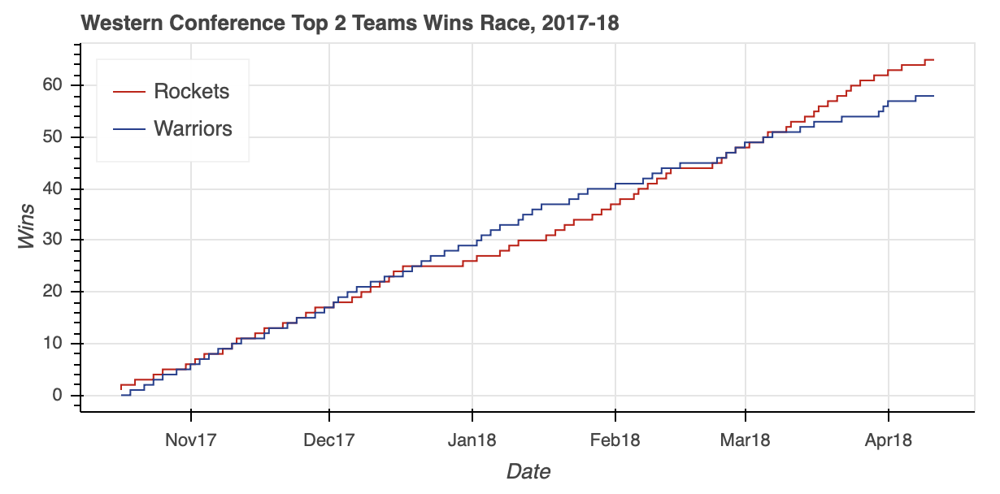

Different approach, same result. Where in the first example I created two ```ColumnDataSource``` objects, one each from a slice of the ```westTop2``` ```DataFrame```. I actually could have just done that slice with the ```ColumnDataSource``` as illustrated above. 

The ```ColumnDataSource``` object has three built in filters which can be used to create views on your data using a ```CDSView``` object:

* ```GroupFilter``` allows you to select rows from a ```ColumnDataSource``` given a categorical reference value
* ```IndexFilter``` allows you to select rows from a ```ColumnDataSource``` via a list of integer indices
* ```BooleanFilter``` allows you to select rows from a ```ColumnDataSource``` using a list of ```boolean``` values, with ```True``` rows being selected

Well the Western Conference sure was an exciting race, but I forget if the Eastern Conference was the same. I sort of want to view them in a single visualization. A perfect segway to the next topic - layouts. 

If you are still craving more, there is plenty more to chew on related to the  ```ColumnDataSource``` and other source objects offered through Bokeh [here](https://bokeh.pydata.org/en/latest/docs/user_guide/data.html). 


## Organizing Multiple Visualizations with Layouts

The Eastern Conference standings came down to two rivals in the Atlantic Division - the Boston Celtics and the Toronto Raptors. Before I replicate the steps used to create ```westTop2```, I want to try to put the ```ColumnDataSource``` to the test one more time using what you learned above. Can I feed it the entire ```standings``` ```DataFrame``` and then create views for the two teams straight from that?

```python
# Bokeh libraries
from bokeh.plotting import figure, show
from bokeh.io import output_notebook
from bokeh.models import ColumnDataSource, CDSView, GroupFilter

# Output inline in the notebook
output_notebook()

# Create a ColumnDataSource 
cds = ColumnDataSource(standings)

# Create views for each team
celticsView = CDSView(source=cds, 
                      filters=[GroupFilter(column_name='teamAbbr', group='BOS')])
raptorsView = CDSView(source=cds, 
                      filters=[GroupFilter(column_name='teamAbbr', group='TOR')])

# Create and configure the figure
eastFig = figure(x_axis_type="datetime", 
             plot_height=300,
             plot_width=600,
             title="Eastern Conference Top 2 Teams Wins Race, 2017-18",
             toolbar_location=None)

# Add axis labels
eastFig.xaxis.axis_label = 'Date'
eastFig.yaxis.axis_label = 'Wins'

# Render the race as step lines
eastFig.step('stDate', 'gameWon', color='#00611B', legend='Celtics', 
             source=cds, view=celticsView)
eastFig.step('stDate', 'gameWon', color='#D50F44', legend='Raptors', 
             source=cds, view=raptorsView)

# Move the legend to the upper left corner
eastFig.legend.location = "top_left"

# Show the plot
show(eastFig)
```

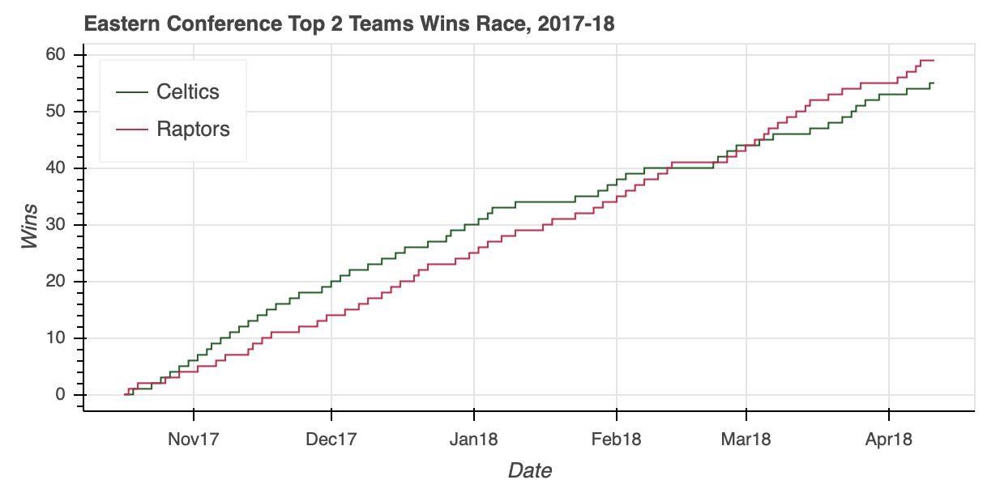Not too shabby. The ```ColumnDataSource``` was able to isolate the relevant data within  a 5,040-by-39 ```DataFrame``` without breaking a sweat, saving me a few lines of ```pandas``` code in the process. And what do you know, the Eastern Conference race was no slouch. After the Celtics roared out of the gate, the Raptors clawed all the way back to overtake their division rival and finish the regular season with five more wins. Okay, now that I have my two visualizations it is time to put them together. 

For those familiar with the ```matplotlib``` ```subplot``` paradigm, Bokeh offers the ```colum()```, ```row()```, and ```gridplot()``` functions in its ```bokeh.layouts module```. These functions can more generally be classified as _layouts_. 

The usage is very straightforward. If I want to put my two visualizations in a vertical configuration I can do so with:

```python
# Bokeh library
from bokeh.layouts import column

# Plot the two visualizations in a vertical configuration
show(column(eastFig, westFig))
```

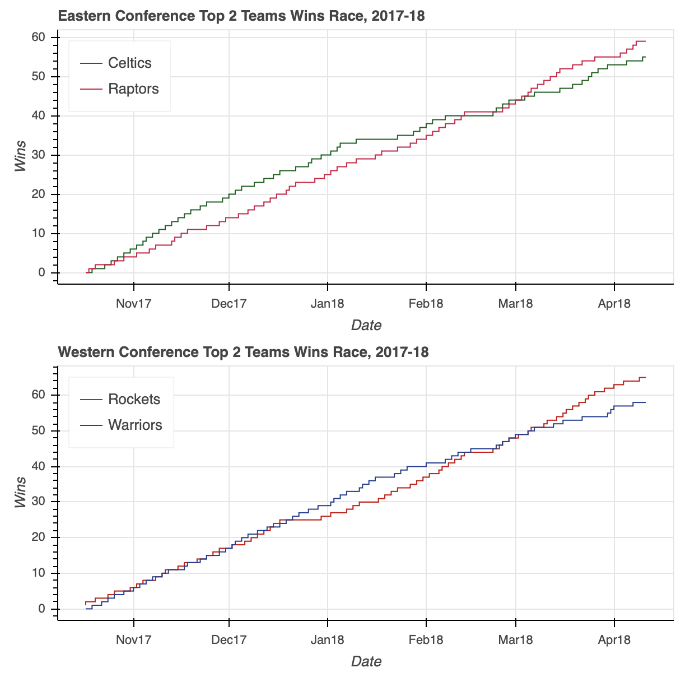

I'll save you the two lines of code, but rest assured swapping ```column``` for ```row``` in the snippet above will similarly configure the two plots in a horizontal configuration. 

The two visualizations above do not have a toolbar, but if they did each figure would have its own. That is one of the main reasons to use ```gridplot()``` instead. Syntactically ```gridplot()``` also is slightly different in that instead of being passed a tuple as input it requires a list of lists, where each list represents a row in the grid:

```python
# Bokeh library
from bokeh.layouts import gridplot

# Add a toolbar to both figures
eastFig.toolbar_location = 'right'
westFig.toolbar_location = 'right'

# Reduce the width of both figures
eastFig.plot_width = 300
westFig.plot_width = 300

# Edit the titles
eastFig.title.text = 'Eastern Conference'
westFig.title.text = 'Western Conference'

# Plot the two visualizations in a horizontal configuration
show(gridplot([[eastFig, westFig]]))
```

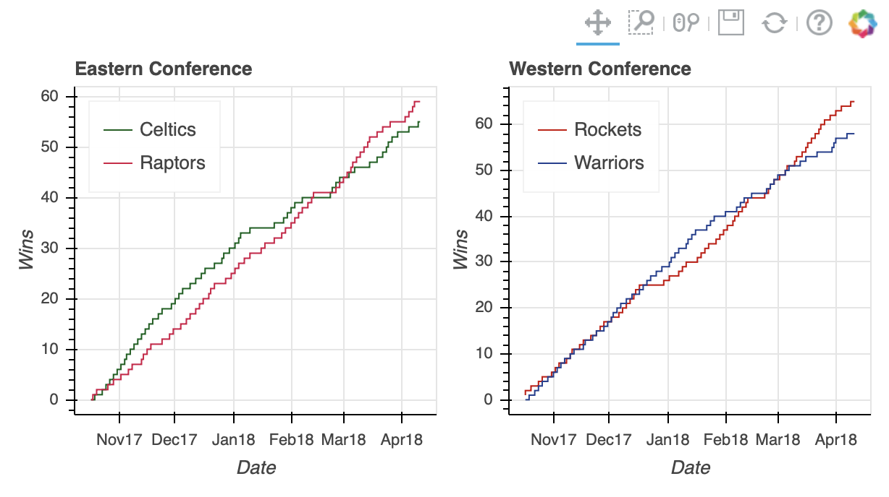

Lastly, ```gridplot()``` allows the passing of ```None``` values, which are interpreted as blank spaces. Therefore if I wanted to leave a placeholder for two additional plots I could use:

```
# Plot the two visualizations with placeholders
show(gridplot([[eastFig, None], [None, westFig]]))
```


Pretty cool, but I think I'd rather view both visualizations at their full size without having to squash them down to fit next to or on top of each other. Plus, I can do the above in ```matplotlib``` pretty easily. So it is time to use something that sets Bokeh apart - tabbed layouts. 

A tabbed layout consists of two Bokeh widget functions - ```Tab()``` and ```Panel()``` from the ```bokeh.models.widgets``` sub-module. As in using ```gridplot()```, making a tabbed layout is similarly straightforward:

```python
# Bokeh Library
from bokeh.models.widgets import Tabs, Panel

# Increase the plot widths
eastFig.plot_width = 800
westFig.plot_width = 800

# Create two panels, one for each conference
eastPanel = Panel(child=eastFig, title='Eastern Conference')
westPanel = Panel(child=westFig, title='Western Conference')

# Assign the panels to Tabs
tabs = Tabs(tabs=[eastPanel, westPanel])

# Show the tabbed layout
show(tabs)
```

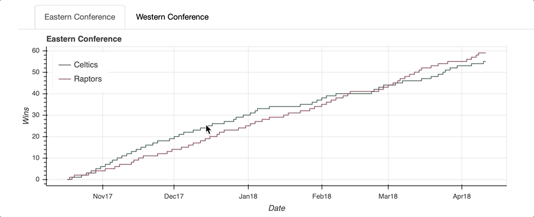

The first step is to create a ```Panel()``` for each tab. I realize that sounds a little confusing, but think of the ```Tabs()``` function as the mechanism that organizes the individual tabs created with ```Panel()```. 

Each ```Panel()``` takes as input a child, which can either be a single ```figure()``` or a layout (recall a layout is a general name for a ```colum()```, ```row()```, or ```gridplot()``` ). Once your panels are assembled, they can be passed as input to ```Tabs()``` in a list.  

So now that you understand how to access, draw, and organize your data it is time to move on to the real magic of Bokeh - interaction! As always, check out [Bokeh's user guide](https://bokeh.pydata.org/en/latest/docs/user_guide/layout.html). 


## Adding Interaction

Even Bokeh describes itself as an [_interactive visualization library_](https://bokeh.pydata.org/en/latest/docs/user_guide/quickstart.html#userguide-quickstart). In this section, we'll touch on the following elements that will illustrate what that really means:

* The toolbar 
* Selection
* Hover actions
* Linking 
* Interactive legends 


**The Toolbar**

As you can see, the first item on that list has been there the entire time. If you've been following along you may have already played with it. The default Bokeh ```figure()``` comes with a toolbar out of the box.

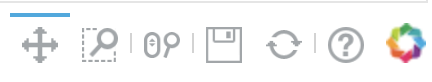

The default toolbar, as seen above, comes with the following tools (from left to right): **Pan**, **Box Zoom**, **Wheel Zoom**, **Save**, **Reset**, a link to [**Bokeh's user guide for Configuring Plot Tools**](https://bokeh.pydata.org/en/latest/docs/user_guide/tools.html#built-in-tools), and a link to the [**Bokeh homepage**](https://bokeh.pydata.org/en/latest/). 

The toolbar can be removed by passing ```toolbar_location=None``` when instantiating a figure object, or relocated by passing any of ```'above'```, ``` 'below'```, ```'left'```, or ``` 'right'```. 

Additionally, the toolbar can be configured to include any combination of tools you desire. By my count, Bokeh offers 14 specific tools across five categories: Pan/Drag, Click/Tap, Scroll/Pinch, Actions, and Inspectors. To geek out on tools , check out [Specifying Tools](http://bokeh.pydata.org/en/0.11.1/docs/user_guide/tools.html#specifying-tools). Otherwise I'll illustrate various tools for the various interactions covered herein. 


**Selection**

Implementing selection behavior is as easy as adding a few select keywords when declaring your glyphs. To show you, I'll create a scatter plot that relates a player's total number of three-point shot attempts to the percentage made (for players with at least 100 three-point shot attempts). I've aggregated this data in a Pandas DataFrame named ```threeTakers```:

```python
# Preview the data
threeTakers.sample(5)
```

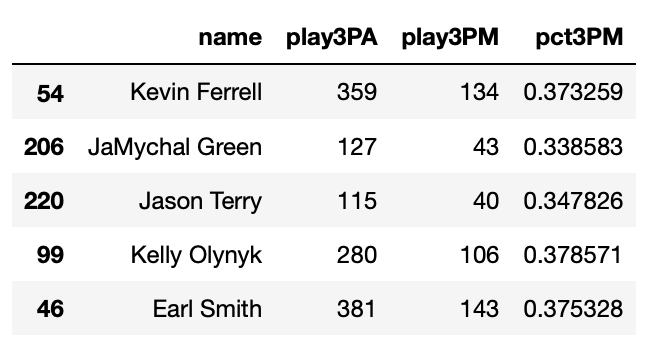

I want to be able to select a groups of players in the distribution, and in doing so mute the color of the glyphs representing the non-selected players:

```python
# Bokeh Libraries
from bokeh.plotting import figure, show
from bokeh.io import output_notebook
from bokeh.models import ColumnDataSource
from bokeh.models import NumeralTickFormatter

# Output inline in the notebook
output_notebook()

# Store the data in a ColumnDataSource
source = ColumnDataSource(threeTakers)

# Specify the selection tools to be made available
selectTools = ['box_select', 'lasso_select', 'poly_select', 'tap', 'reset']

# Create the figure
fig = figure(
    plot_height=400,
    plot_width=600,
    x_axis_label='Three-Point Shots Attempted',
    y_axis_label='Percentage Made',
    title='3PT Shots Attempted vs. Percentage Made (min. 100 3PA), 2017-18',
    toolbar_location='below',
    tools=selectTools)

# Format the y-axis tick labels as percenages
fig.yaxis[0].formatter = NumeralTickFormatter(format="00.0%")

# Add square representing each player
fig.square(
    x='play3PA', 
    y='pct3PM', 
    source=source,
    color='#6BADDF',
    selection_color='#021A46',
    nonselection_color='#B6B7BB',
    nonselection_alpha=0.3)

# Visualize
show(fig)
```

First, I specified the specific selection tools I wanted to make available - ```'box_select'```, ```'lasso_select'```, ```'poly_select'```, and ```'tap'``` (plus a Reset button) in a list called ```selectTools```. I instantiated a figure placing the toolbar ```'below'``` the plot and configured with my specified tools. 


Each player is initially represented by a light blue square glyph. I specified two things I wanted to happen if a player or group of players is selected: 

* Turn the selected player(s) to navy blue
* Turn the all non-selected players to a light gray color with 0.3 opacity

That's it! Just a few quick additions and here's how it turned out:


For even more information about what you can do upon selection, check out [Selected and Unselected Glyphs](https://bokeh.pydata.org/en/latest/docs/user_guide/styling.html#selected-and-unselected-glyphs). 


**Hover Actions**

So I've implemented the ability to select specific player datapoints that seem of interest in my scatter plot, but how can I quickly determine who the individual players in my selection are? One option is to use Bokeh's ```HoverTool()``` to show a tooltip when my cursor crosses paths with a glyph. All I need to do is append the following to the code snippet above: 

```python
# Bokeh Library
from bokeh.models HoverTool

# Format the tooltip
tooltips = [
            ('Player','@name'),
            ('3PM', '@play3PM'),
            ('3PA', '@play3PA'),
            ('3P%','@pct3PM{00.0%}'),
           ]

# Add the HoverTool to the figure
fig.add_tools(HoverTool(tooltips=tooltips))

# Visualize
show(fig)
```

The ```HoverTool()``` is slightly different than the selection tools you saw above in that it has properties - in this case, ```tooltips```. 

I first created a formatted tooltip by creating a list of tuples containing a description and reference to my ```ColumnDataSource```. This list was passed as input to the ```HoverTool()``` and then I simply added my new ```HoverTool()``` to the figure using ```figure()```'s ```add_tools()``` method. Here's what happened:


The first thing you may notice is the addition of the Hover button to the toolbar, which can be toggled on and off. 

Otherwise, I tried to point out that hover is independent of selection. I am able to move my cursor over any glyph and see its corresponding tooltip - regardless of if it is selected or not. 

I like that addition, but I feel like I also want to further emphasize the players I am hovering over. Bokeh makes that possible with hover inspections. Here is a slightly modified version of the code snippet that added the tooltip:

```python
# Bokeh Library
from bokeh.models HoverTool

# Format the tooltip
tooltips = [
            ('Player','@name'),
            ('3PM', '@play3PM'),
            ('3PA', '@play3PA'),
            ('3P%','@pct3PM{00.0%}'),
           ]

# Configure a renderer to be used upon hover
hoverGlyph = \
    fig.circle(
        x='play3PA', 
        y='pct3PM', 
        source=source,
        size=15,
        alpha=0,
        hover_fill_color='#3E6085',
        hover_alpha=0.5)

# Add the HoverTool to the figure
fig.add_tools(HoverTool(tooltips=tooltips, renderers=[hoverGlyph]))

# Visualize
show(fig)
```

I have created a completely new glyph, this time circles instead of squares, and assigned it to ```hoverGlyph```. Note that I am setting the initial opacity to zero so that this glyph only appears on hover. The properties that I want to appear upon hover are captured by setting ```hover_alpha``` to 0.5 along with the ```hover_fill_color```. Now when I hover over various glyphs I will see a small blue circle appear over the original square:

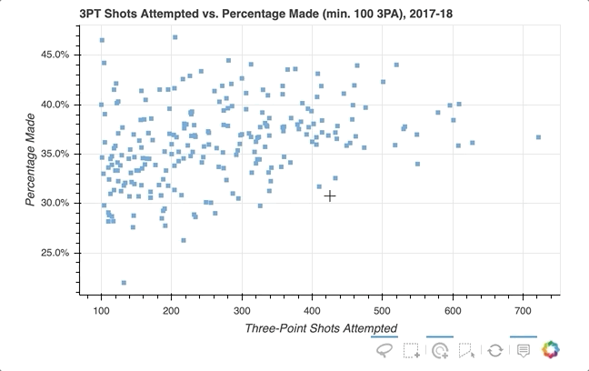

To further explore the capabilities of the ```HoverTool()```, check out [HoverTool](https://bokeh.pydata.org/en/latest/docs/user_guide/tools.html#hovertool) and [Hover Inspections](https://bokeh.pydata.org/en/latest/docs/user_guide/styling.html#hover-inspections).


**Linking**

Linking is the process of syncing elements of different visualizations within a layout. For instance, maybe I want to link the axes of multiple plots to ensure that if I zoom in on one it is reflected on another. Let's see how it is done. 

For this example, I want to create a visualization that allows me to pan to different segments of a team's schedule and examine various game stats. Each stat will be reprented by its own plot in a two-by-two ```gridplot()``` . 

I will be focusing on my favorite team, the Philadelphia 76ers, and I've gathered the data I want to visualize in a ```DataFrame``` named ```phiGameStats```:

```python
# Preview the data
phiGameStats.head(10)
```

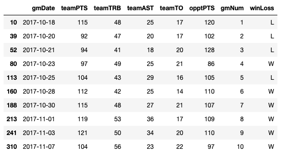

Here is the code first, and then I'll highlight some points of emphasis:

```python
# Bokeh Libraries
from bokeh.plotting import figure, show
from bokeh.io import output_notebook
from bokeh.models import ColumnDataSource, CategoricalColorMapper, Div
from bokeh.layouts import gridplot, column

# Output inline in the notebook
output_notebook()

# Store the data in a ColumnDataSource
gameStats = ColumnDataSource(phiGameStats)

# Create a CategoricalColorMapper that assigns specific colors to wins and losses
winLossMapper = CategoricalColorMapper(factors = ['W', 'L'], palette=['Green', 'Red'])

# Specify the tools
toolList = ['xpan', 'reset', 'save']

# Create a figure and column chart for each stat category
ptsFig = figure(y_axis_label='Points', plot_height=200, plot_width=400, x_range=(1,10), tools=toolList)
ptsFig.vbar(x='gmNum', top='teamPTS', source=gameStats, width=0.9, color=dict(field='winLoss', transform=winLossMapper))

astFig = figure(y_axis_label='Assists', plot_height=200, plot_width=400, x_range=(1,10), tools=toolList)
astFig.vbar(x='gmNum', top='teamAST', source=gameStats, width=0.9, color=dict(field='winLoss', transform=winLossMapper))

rebFig = figure(x_axis_label='Game Number', y_axis_label='Rebounds', plot_height=200, plot_width=400, x_range=(1,10), tools=toolList)
rebFig.vbar(x='gmNum', top='teamTRB', source=gameStats, width=0.9, color=dict(field='winLoss', transform=winLossMapper))

tovFig = figure(x_axis_label='Game Number', y_axis_label='Turnovers', plot_height=200, plot_width=400, x_range=(1,10), tools=toolList)
tovFig.vbar(x='gmNum', top='teamTO', source=gameStats, width=0.9, color=dict(field='winLoss', transform=winLossMapper))

# Create layout
grid = gridplot([[ptsFig, astFig], [rebFig, tovFig]])

# Link together the x-axes
ptsFig.x_range = astFig.x_range = rebFig.x_range = tovFig.x_range

# Add a title for the entire visualization using Div 
html = """<h3>Philadelphia 76ers Game Log</h3>
<b><i>2017-18 Regular Season</i>
<br>
</b><i>Wins in green, losses in red</i>
"""
supTitle = Div(text=html)

# Visualize
show(column(supTitle,grid))
```

Okay, lots of new things going on - I'll start from the top:

* I want to be able to clearly tell which games were wins versus losses. With that in mind I've used a ```CategoricalColorMapper``` to map a color to the respective values of the ```winLoss``` column of my ```ColumnDataSource```
* The initial view will only show the first 10 games of the 76ers' season, and I want to be able to pan horizontally throughout the season. Thus I specified for the toolbar to have an ```xpan``` tool to allow me to pan the plots without having to worry about accidentally skewing the view along the vertical axis
* The ```CategoricalColorMapper``` is implemented upon the creation of the glyph as seen above
* Observe how simple it is to link the axes. To implement the syncing of the x-axes across the four plots, all I have to do is set the ```x_range``` of their respective figures to each other. That's it! 
* Lastly, a little bit of a trick. I want to add a title bar to the visualization. I could have tried to do this on the ```ptsFig``` but it would have been limited to the space of that figure. In the example, I used Bokeh's ability to interpret HTML to insert  a ```Div``` element that contains my title information. Once that is created, I simply combine that with my ```gridplot()``` in a ```column()``` layout. 

So here is what all that actually looks like:


For more on the CategoricalColorMapper, see the [Colors](https://bokeh.pydata.org/en/latest/docs/user_guide/categorical.html#colors) section of [Handling Categorical Data](https://bokeh.pydata.org/en/latest/docs/user_guide/categorical.html#handling-categorical-data) on Bokeh's User Guide.

Similarly, I can easily implement linked selections - where a selection on one plot will be reflected on others. 

To show you how this works, I am going to create a visualization with two scatter plots - one that shows the 76ers' two-point versus three-point field goal percentage on a game-by-game basis, the other showing the 76ers' team points versus opponent points on a game-by-game basis. 

I want to be able to select data points on the left side scatter plot and quickly be able to recognize if the corresponding datapoint on the right scatter plot is a win or loss. I've created a new ```DataFrame``` for this example called ```phiGameStats2```:

```python
# Preview data
phiGameStats2.head(5)
```

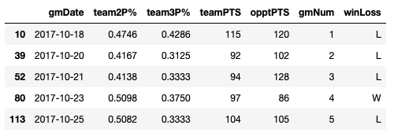

Here is the code first, and then I'll take you through what's happening:

```python
# Bokeh Libraries
from bokeh.plotting import figure, show
from bokeh.io import output_notebook
from bokeh.models import ColumnDataSource, CategoricalColorMapper, NumeralTickFormatter
from bokeh.layouts import gridplot

# Output inline in the notebook
output_notebook()

# Store the data in a ColumnDataSource
gameStats = ColumnDataSource(phiGameStats2)

# Create a CategoricalColorMapper that assigns specific colors to wins and losses
winLossMapper = CategoricalColorMapper(factors = ['W', 'L'], palette=['Green', 'Red'])

# Specify the tools
toolList = ['lasso_select', 'tap', 'reset', 'save']

# Create a figure relating the percentages
pctFig = figure(title='2PT FG % vs 3PT FG %, 2017-18 Regular Season', 
                plot_height=400, plot_width=400, tools=toolList,
                x_axis_label='2PT FG%', y_axis_label='3PT FG%')
pctFig.circle(x='team2P%', y='team3P%', source=gameStats, size=12, color='black')

# Format the y-axis tick labels as percenages
pctFig.xaxis[0].formatter = NumeralTickFormatter(format="00.0%")
pctFig.yaxis[0].formatter = NumeralTickFormatter(format="00.0%")

# Create a figure relating the totals
totFig = figure(title='Team Points vs Opponent Points, 2017-18 Regular Season', 
                plot_height=400, plot_width=400, tools=toolList, 
                x_axis_label='Team Points', y_axis_label='Opponent Points')
totFig.square(x='teamPTS', y='opptPTS', source=gameStats, size=10,
         color=dict(field='winLoss', transform=winLossMapper))


# Create layout
grid = gridplot([[pctFig, totFig]])

# Visualize
show(grid)
```

Looks pretty par for the course. One new trick I added for this example is formatting the axes using a ```NumericalTickFormatter```. Otherwise, I didn't need to add anything special to implement the linked selection. 

This is a great example of the power in using a ```ColumnDataSource```. Without having to add any extra code, Bokeh already knows the relationship between the datapoints on the respective scatter plots. Therefore when I use any of the selection tools made available, the interaction is ready. Here's how it looks in action:

 

Pretty cool! By selecting a random sample of datapoints in the upper right quadrant of the left scatter plot - those corresponding to both high two-point and three-point field goal percentage - the datapoints on the right scatter plot are highlighted. I'm able to quickly confirm my intuition, shooting higher percentages from both two-point and three-point range is associated with more wins - as all but two of the games selected were wins.  

All the details on linking plots can be found at [Linking Plots](https://bokeh.pydata.org/en/latest/docs/user_guide/interaction/linking.html) in the Bokeh User Guide.


**Interactive Legends**

And that brings us to the final interactivity example in this tutorial - interactive legends. 

I showed you in the ***Drawing Data with Glyphs*** section how easy it is to implement a legend when creating your plot. With the legend in place, adding interactivity is easy as assigning a ```click_policy```. Using a single line of code, you can quickly add the ability to either **hide** or **mute** data using the legend.

Here's how:

```python
# Bokeh Libraries
from bokeh.plotting import figure, show
from bokeh.io import output_notebook
from bokeh.models import ColumnDataSource, CDSView, GroupFilter
from bokeh.layouts import row

# Output inline in the notebook
output_notebook()

# Store the data in a ColumnDataSource
playerGmStats = ColumnDataSource(playerStats)

# Create a view each for 
# LeBron James
lebronFilters = [GroupFilter(column_name='playFNm', group='LeBron'), 
                 GroupFilter(column_name='playLNm', group='James')]
lebronView = CDSView(source=playerGmStats,filters=lebronFilters)
# and Kevin Durant
durantFilters = [GroupFilter(column_name='playFNm', group='Kevin'), 
                 GroupFilter(column_name='playLNm', group='Durant')]
durantView = CDSView(source=playerGmStats,filters=durantFilters)

# Create a scatter plot called hideFig that compares the players' game-by-game points and rebounds
hideFig = figure(title='Click Legend to HIDE Data', plot_width=400, 
                 x_axis_label='Points', y_axis_label='Rebounds', toolbar_location=None)
hideFig.circle(x='playPTS', y='playTRB', source=playerGmStats, view=lebronView, 
               size=12, alpha=0.7, color='#002859', legend='LeBron James')
hideFig.circle(x='playPTS', y='playTRB', source=playerGmStats, view=durantView, 
               size=12, alpha=0.7, color='#FFC324', legend='Kevin Durant')

# Replicate scatter plot as muteFig
muteFig = figure(title='Click Legend to MUTE Data', plot_width=400, 
                 x_axis_label='Points', toolbar_location=None)
muteFig.circle(x='playPTS', y='playTRB', source=playerGmStats, view=lebronView, 
               size=12, alpha=0.7, color='#002859', legend='LeBron James',
               muted_alpha=0.1)
muteFig.circle(x='playPTS', y='playTRB', source=playerGmStats, view=durantView, 
               size=12, alpha=0.7, color='#FFC324', legend='Kevin Durant',
               muted_alpha=0.1)

# Add interactivity to the legend
hideFig.legend.click_policy='hide'
muteFig.legend.click_policy='mute'

# Visualize
show(row(hideFig, muteFig))
```


There you have it. Once the legend is place, all you have to do is assign either ```'hide'``` or ```'mute'``` to the figure's ```legend.click_policy``` property. This will automatically turn your basic legend into an interactive legend. 

Also note that specifically for ```'mute'``` the additional property of ```'muted_alpha'``` was set in the respective ``circle()`` glyphs for LeBron James and Kevin Durant. 

For more on on all things interaction in Bokeh, [Adding Interactions](https://bokeh.pydata.org/en/latest/docs/user_guide/interaction.html) in the Bokeh User Guide is a great place to start. 


## Summary and Next Steps

We made it to the end of the tutorial - what a journey! 

You should now have a great set of tools to turn your data into beautiful interactive visualizations with Bokeh. To quickly recap what I touched on:

* A general template for crafting your visualization in Bokeh
* Configuring your script to render to either a static HTML file or Jupyter Notebook
* How to instantiate and configure the ```figure()``` object
* Building your visualization idea from scratch using glyphs
* Accessing your data via Bokeh's ```ColumnDataSource``` object
* Organizing multiple plots in grid and tabbed layouts
* Adding different forms of interaction, including selections, hover actions, linking, and interactive legends

And there is so much more: creating more chart types - from pie charts to network graphs, exporting your visualizations, embedding your finished product into an HTML document, integrating widgets and UI elements, etc.  

Do I hear part two, anyone? 

As I've referenced throughout the tutorial, the official [Bokeh User Guide](https://bokeh.pydata.org/en/latest/docs/user_guide.html) is an excellent place to dig into these more advanced topics. Also I'd recommend checking out [Bokeh's Gallery](https://bokeh.pydata.org/en/latest/docs/gallery.html) for tons of examples and inspiration. 